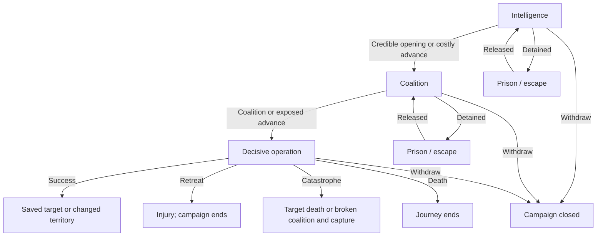

# Choose your intent. Live with the result.

The player controls their objective; wheels resolve uncertain consequences. Origins and the horizon remain randomized. Choosing an intent commits immediately, consumes no game time, and is recorded as a choice rather than a probability roll. There is no reroll or journey undo. A completed chapter still takes four months, except an explicit time skip.

## Progress that never wastes a training target

Capped stats are removed from training targets. When every age-eligible target is capped, dedicated training, mentors, sparring, and training time skips disappear from the horizon. Mastered stats stay visible as gray MAX chips in the development journal. There is no passive stat regression. Existing injury and aging penalties still affect combat rating.

Quiet practice, combat manuals, prison practice, social lessons, and pure cognitive practice outcomes are filtered when their target is capped. Mentor eligibility requires at least one uncapped specialty. A partly useful story or combat outcome remains available; any capped incidental practice becomes a legacy lesson rather than a misleading +0 award. Near-cap gains use only the remaining practice. Crew background power-growth outcomes are also removed at their power cap.

## Intent changes weights, not certainty

### Combat intentions

| Intent | Effect |
| --- | --- |
| Read the fight | Keep the baseline balance between winning and surviving. |
| Fight for victory | Victory and lethal victory ×1.35; escape ×0.55; injury and death ×1.2. Great power gaps still matter. |
| Protect your people | Rescue/mercy ×1.7; controlled victory ×1.15; lethal victory ×0.45. Crew support helps you hold the line. |
| Get everyone out | Escape ×1.8; death ×0.75; victories ×0.55. Escape remains uncertain. |

### Saga intentions

| Intent | Effect |
| --- | --- |
| Keep your options open | Use the story’s baseline odds and the evidence you already hold. |
| Find the truth | Insight, evidence and archive outcomes ×1.5; capture ×1.2. Better information can attract scrutiny. |
| Put people first | Trust and sanctuary ×1.5; supply and injury ×1.2. Saving people can cost resources or health. |
| Pursue your own advantage | Profitable betrayal ×2 where available; sanctuary ×0.6. Your crew and canon contacts remember the result. |

Multipliers apply to outcome weights before normalization. Combat still has one resolution roll. The existing automatic instinct comes after your intention and retains its visible probability adjustment. Techniques and crew specialties modify the same outcome model; their bonuses do not remove an opponent’s power advantage.

## Twelve advanced disciplines

Techniques are separate applications of existing ability, not infinitely rising base stats. Their event appears only when an unlearned technique has all its prerequisites. The player selects the discipline, then rolls for learning, useful partial progress, or strain. Failed attempts improve later learning odds; success permanently removes that technique from the learning pool.

| Discipline | Required existing mastery | Purpose | Combat outcome weights |
| --- | --- | --- | --- |
| Still-water perception | Observation Haki: Skilled; Battle IQ: Tactical | An authored discipline in reading movement: improves disengagement and reduces ambush losses. | escape ×1.12 |
| Future-sight discipline | Observation Haki: World-class; Battle IQ: Brilliant | A demanding advanced Observation discipline inspired by canon future sight; composure and training remain necessary. | victory ×1.1; escape ×1.12 |
| Flowing Armament | Armament Haki: Advanced technique; Fighting mastery: Expert | Practice emitting Armament with minimal wasted force. This is earned training, not a bloodline gift. | victory ×1.12 |
| Internal-destruction discipline | Armament Haki: World-class; Battle IQ: Brilliant | A separate advanced Armament application. Its modest game bonus does not negate durability or power gaps. | victory ×1.12; lethal ×1.08 |
| Conqueror’s infusion | Conqueror’s Haki: World-class; Armament Haki: Advanced technique; Fighting mastery: Master | Only existing Conqueror’s users can attempt this advanced application. It never grants the rare Haki type. | victory ×1.14; lethal ×1.08 |
| Precision fruit control | Devil Fruit mastery: Creative techniques; Battle IQ: Tactical | Build reliable low-cost applications of your own fruit instead of copying another user’s powers. | escape ×1.1; spared ×1.1 |
| A signature Devil Fruit technique | Devil Fruit mastery: Expert control; Fighting mastery: Practiced | Create one repeatable application of the fruit you actually possess. No second fruit or unrelated ability is granted. | victory ×1.12 |
| Awakening control | Devil Fruit mastery: Awakened; Stamina: Elite | Refine an already-awakened fruit. This practice does not unlock awakening for an unawakened user. | victory ×1.1; escape ×1.06 |
| A blade without wasted motion | Weapon 1 mastery: Expert; Battle IQ: Tactical | An authored sword discipline emphasizing distance and commitment; no automatic black blade. | victory ×1.1; escape ×1.06 |
| Command under fire | Battle IQ: Brilliant; Fighting mastery: Practiced | Learn clear signals and retreat formations. The lessons improve survival without creating extra crew members. | spared ×1.18; escape ×1.08 |
| Iron resolve | Endurance: Monstrous; Durability: Elite | Learn to preserve enough strength to survive a lost exchange. | spared ×1.15; wounded ×1.1 |
| Precision footwork | Speed: Monstrous; Fighting mastery: Expert | Develop efficient movement for creating a safe exit or a controlled opening. | escape ×1.15; victory ×1.05 |

All discipline bonuses combined are capped at ×1.5 per outcome before intent and crew modifiers. Conqueror’s infusion requires existing Conqueror’s Haki; awakening control requires an already-awakened fruit. No technique grants a second fruit, changes its type, or automatically creates a black blade. Names, thresholds, bonuses and learning odds are authored game rules.

Canon inspirations: [Katakuri and future-seeing Observation](https://one-piece.com/story/wholecakeisland/index.html), [Hyogoro’s teaching of advanced Haki](https://one-piece.com/character/Hyougoro/index.html), and the [Wano confrontation](https://one-piece.com/story/land_of_wano2/index.html).

## Six campaigns that can rewrite canon

Each campaign has intelligence, coalition, and decisive-operation chapters. The horizon selects a turning point available at your location and in your starting era. You choose careful preparation, a bolder plan, or funded support when affordable. The final choice contrasts a prepared operation with direct confrontation. You can also withdraw permanently.

Preparation is recorded as intelligence and coalition points. Bolder successes can earn twice as much preparation but invite more exposure and detention. Funding costs 25,000 berries once when the result resolves; an affordable commitment cannot silently become free. In the finale, personal power and preparation are compared with the authored threat rating. A prepared extraction is not the same as personally defeating an admiral.

### Rewrite the execution at Marineford

Ace’s scheduled execution brings a war to Marineford. You can attempt to change his fate by building a route out, gathering help, and surviving the final rescue.

**Where:** Marineford, Sabaody Archipelago, Impel Down. **Starting eras:** Summit War opening. **Threat rating:** 132 (game estimate).

Success saves Ace in your timeline. A failed final rescue can kill him permanently. Saving him does not automatically defeat an admiral.

[Canon source](https://one-piece.com/story/marineford/index.html). The player outcomes above are alternate history.

### Break the Beast Pirates’ occupation

The resistance needs prisoners freed, supply routes secured, and a force capable of surviving an Emperor. A lone challenge is very different from a liberation campaign.

**Where:** Wano Country. **Starting eras:** New World opening. **Threat rating:** 145 (game estimate).

Success deposes Kaido locally and creates a liberated territory. It does not automatically kill him, cure SMILE, or clean the rivers.

[Canon source](https://one-piece.com/story/land_of_wano2/index.html). The player outcomes above are alternate history.

### End Doflamingo’s rule

Gather evidence, protect the forgotten, and build an alliance before confronting the ruler whose underworld reaches beyond Dressrosa.

**Where:** Dressrosa Kingdom, Green Bit. **Starting eras:** New World opening. **Threat rating:** 100 (game estimate).

Success ends the local regime and creates a liberated territory. Surviving enemies and brokers may return.

[Canon source](https://one-piece.com/story/dressrosa/index.html). The player outcomes above are alternate history.

### Bring Vegapunk out alive

A government siege threatens the scientist and the people carrying his research. An evacuation needs more than a powerful fighter: it needs a vessel, timing, and a protected route.

**Where:** Egghead Island, G-14. **Starting eras:** New World opening. **Threat rating:** 128 (game estimate).

Success preserves the scientist in this alternate timeline and creates a research archive. Failed extraction can permanently kill the target.

[Canon source](https://one-piece.com/story/egghead/index.html). The player outcomes above are alternate history.

### Expose and overturn Baroque Works

Two armies are fighting over a lie. Your campaign can establish the evidence, win neutral support, and break Crocodile’s hold over the country.

**Where:** Alabasta Kingdom, Rainbase, Alubarna. **Starting eras:** Summit War opening, New World opening. **Threat rating:** 70 (game estimate).

Victory creates a liberated civic territory. Your role is recorded without automatically crowning you its monarch.

[Canon source](https://one-piece.com/story/alabasta/index.html). The player outcomes above are alternate history.

### Challenge an Emperor’s claim

Your flag has become a challenge to an Emperor’s local authority. A campaign needs allies, supplies, and strength; arriving in their waters does not make you their equal.

**Where:** Whole Cake Island, Wano Country. **Starting eras:** New World opening. **Threat rating:** 142 (game estimate).

Success establishes your flag over this island and an Emperor contender title. It does not grant the entire New World or an official universal ranking.

[Canon source](https://one-piece.com/story/land_of_wano2/index.html). The player outcomes above are alternate history.

A dead target cannot be resurrected by starting a rescue. A dead or already-deposed ruler cannot be farmed for more claims. Territory campaigns remain attached to the island where they began; the Emperor claim requires a pirate flag. Saved people can still die in a later, separate event. Successful interventions increase world stability by 4 and reduce central government control by 3, within the existing 0–100 bounds.

## Thirty companion milestones

Each of ten crew roles has a three-part personal dream. The player chooses a living companion and whether to support the dream, treat an injury, or reconcile. Loyalty influences outcomes. Completing a dream unlocks a role specialty while that companion remains in the crew. A spotlight chapter replaces that person’s offscreen turn, preventing a second unrelated fate from immediately overwriting their episode. Other companions still receive background turns.

Canon companions with generic roster roles use recognizable specialties: Nami navigates, Sanji cooks, Chopper and Crocus provide medicine, Franky builds, Brook performs, Robin researches, Jinbe helms, and Usopp keeps watch. These personal missions are authored alternate stories, not assertions of newly canonical episodes.

### Navigator: An atlas no crew has to die to finish

1. Recover a chart lost in a wreck
2. Test a route through a dangerous current
3. Publish a safe passage for ordinary sailors

**Navigator network:** Storm safe-outcome weight +20% while this specialist sails with you.

### Doctor: A clinic that turns nobody away

1. Document an illness in an overlooked port
2. Supply a working treatment program
3. Train a local team to run the clinic

**Shipboard triage:** Illness recovery weight +25% while this specialist sails with you.

### Cook: A table where enemies can eat together

1. Recover a family recipe from a divided port
2. Provision a hungry community
3. Open a kitchen that survives without your crew

**Restorative meals:** Quiet rest heals one additional injury while this specialist sails with you.

### Shipwright: A hull that brings everyone home

1. Salvage a master builder’s unfinished design
2. Test the repairs through a difficult passage
3. Build a vessel ordinary crews can maintain

**Emergency repairs:** Shipwreck safe-outcome weight +25% while this specialist sails with you.

### Lookout: To see the danger before it takes someone

1. Chart the harbor’s blind approaches
2. Expose a false distress signal
3. Train a watch team for civilian ships

**Early warning:** Combat escape weight +10% while this specialist sails with you.

### Helmsman: A passage through the impossible current

1. Learn the current’s seasonal rhythm
2. Guide a relief vessel through its opening
3. Teach a local pilot to repeat the route

**Steady helm:** Storm and shipwreck injury/death weights ×0.85 while this specialist sails with you.

### Fighter: Strength that can protect without ruling

1. Keep a promise in a one-sided dispute
2. Defend someone who once opposed you
3. Train a neighborhood to protect itself

**Trusted rearguard:** Combat mercy/rescue weight +15% while this specialist sails with you.

### Musician: A song that gets the lost remembered

1. Collect a missing verse from a survivor
2. Perform it where the story was suppressed
3. Teach it to people who will carry it onward

**A shared refrain:** Background crew bond weight +20% while this specialist sails with you.

### Scholar: An archive that belongs to its people

1. Authenticate a fragment with its community
2. Preserve copies in separate safe places
3. Train the next custodian of the collection

**Research partnership:** Saga evidence and insight weights +15% while this specialist sails with you.

### Quartermaster: A supply line no profiteer can hold hostage

1. Expose shortages hidden in the accounts
2. Open a fair replacement supply route
3. Put the route under local management

**Honest accounts:** Trade profit weight +20% while this specialist sails with you.

Completed companions can still need healing or reconciliation. A satisfied, healthy companion leaves the spotlight pool. Departed and dead companions retain their records but provide no active specialty. Original journey recruits cannot reuse a name already attached to a personal storyline.

## An island is a responsibility

Liberation campaigns create a local council; a successful Emperor claim places the island under your flag and records an Emperor contender title. This is a local political claim, not instant sovereignty over every sea.

Each territory starts with stability 55, prosperity 35, and defenses 35. Returning there enables stewardship: protect and rebuild, reopen trade, or demand tribute. Successful reconstruction raises its targeted attribute by 15 and stability by 5. Tribute pays 20,000 berries but costs 15 stability. Unrest costs 12 stability; raids damage defenses, prosperity and stability. Zero stability ends stewardship and makes the island independent. Island destruction also removes stewardship.

Defenses and stability reduce local danger by up to 1.5 points on the existing 0–5 scale. Prosperity improves development success. Defenses reduce raid odds. All three attributes stay between 0 and 100. None are an automatic immunity to battle, world disasters or betrayal.

## Replay and compatibility

Exports remain schema 3 / journey rules 2. A new `developmentCutover` stores the number of prior modern steps. Historical steps replay without new intents, reward changes or filtered outcomes. Each event pins its rule version at its start, so an already-pending older chapter finishes consistently before the new rules begin. New choices carry `kind: choice` and are validated separately from rolls. Reloading cannot re-choose a committed intent. Derived techniques, companion milestones, territories and canon fates are rebuilt from validated history.

`rollJourney` is also used by automated simulation tests, where a supplied seeded policy samples intents to explore lifetimes. The interactive app never uses it to select a player intent.

## Validation

Run `npm test`. Coverage includes every saga path, every campaign final outcome, all technique prerequisites, every crew-role milestone, exact cap filtering, near-cap gains, real crew save replay, choice-versus-roll validation, funded commitments, territorial collapse, and pre-intent fixtures. Desktop/mobile browser checks cover intent cards, keyboard use, absence of accidental Spacebar choices, reload, fate traces and campaign outcomes.
