# The saga atlas

18 sagas · 72 scenes · 216 authored outcome edges · 342 complete paths.

Generated from the playable data by `npm run docs:sagas`. Each arrow is a real wheel result. The wheel chooses the response; the player does not click a tactical choice. Branches reconverge with different evidence, trust, injuries, money and relationships, so reaching the same scene need not produce the same odds.

Each scene is one four-month chapter. Saga selection adds no time. Ordinary chapters can interrupt the thread. Site-specific sagas pause away from their mapped locations. Era filters are starting-era snapshots; this is an alternate chronology, not a calendar reconstruction. Captivity overrides the horizon and death ends the journey.

Canon anchors are short sourced summaries. All player missions, dialogue-free premises, probabilities, mechanical rewards and endings are original fan fiction. Coverage extends through Egghead and the early Elbaph library material (chapters 1133–1134); it does not claim to model every subsequent manga revelation. Unrevealed lore is not filled in as fact.

## Consequences

| Outcome family | Persistent effect |
| --- | --- |
| insight | Practice +8 Battle IQ; dream lead +1 |
| evidence | Evidence +1; practice +5 Battle IQ |
| trust | Crew loyalty +5; trust +1; canon bond +1 |
| supply | Spend up to ฿10,000; trust +1 |
| wound | Injury +1; trust +1 |
| capture | Captured; government heat +1 |
| betrayal | ฿20,000; crew loyalty −8; canon bond −2 |
| estranged | Canon bond −1; promise ends |
| setback | Lose up to ฿5,000; preserve the story in your journal |
| sanctuary | Legacy +2; crew loyalty +8; local refuge; canon bond +2 |
| archive | Legacy +1; dream leads +2; lasting archive |
| exposure | Dream leads +2; government heat +2; outlaw bounty +฿50,000 |

Practice and relationship gains are capped by the existing tracks. Spending never creates debt. A supply branch with insufficient funds becomes less likely and spends only available berries. Government heat is a 0–10 saga-risk modifier; it is separate from the existing world-danger simulation. A saga reputation change concerns its listed cast without claiming a face-to-face meeting.

## Catalog

| Saga | Places | Starting eras |
| --- | --- |
| [The price of a tangerine](#tangerine) | Conomi Islands, Arlong Park | Summit War opening, New World opening |
| [A meal owed to the sea](#baratie) | Baratie | Early Great Pirate Era, Summit War opening, New World opening |
| [Books that would not burn](#ohara) | Ohara | Early Great Pirate Era, Summit War opening, New World opening |
| [The white town’s black ledger](#amber) | Flevance Kingdom, Minion Island | Early Great Pirate Era, Summit War opening, New World opening |
| [Rain on a powder trail](#alabasta) | Alabasta Kingdom, Alubarna, Nanohana, Rainbase | Summit War opening, New World opening |
| [The bell beneath the clouds](#skybell) | Skypiea, Upper Yard, Jaya | Summit War opening, New World opening |
| [The last train before Aqua Laguna](#waterseven) | Water Seven, Enies Lobby, San Faldo | Summit War opening, New World opening |
| [Lot number zero](#auction) | Sabaody Archipelago | Summit War opening, New World opening |
| [Letters from the frozen bay](#summit) | Marineford, Impel Down, Sabaody Archipelago | Summit War opening |
| [Sunlight beneath ten thousand meters](#fishman) | Fish-Man Island | Summit War opening, New World opening |
| [The names the toys remember](#dressrosa) | Dressrosa Kingdom, Green Bit | New World opening |
| [An invitation written in sugar](#wholecake) | Whole Cake Island, Cacao | New World opening |
| [Paper cranes over the factories](#wano) | Wano Country | New World opening |
| [The signal that outlived its speaker](#egghead) | Egghead Island, G-14 | New World opening |
| [The library beneath the giant tree](#elbaph) | Elbaph | New World opening |
| [A logbook before the great era](#roger) | Twins Cape, Loadestar Island | Roger’s final voyage |
| [The empty chair at supper](#crew-oath) | Any sea | Roger’s final voyage, Early Great Pirate Era, Summit War opening, New World opening |
| [The map with three owners](#blackchart) | Any sea | Roger’s final voyage, Early Great Pirate Era, Summit War opening, New World opening |

## The price of a tangerine

**Canon anchor:** Nami’s village suffered under Arlong’s tribute system; her bargain did not protect her savings from corrupt Marines. [Source](https://one-piece.com/story/east_blue/index.html).

**Connected cast:** Nami, Arlong.

**Where:** Conomi Islands, Arlong Park. **Starting eras:** Summit War opening, New World opening.

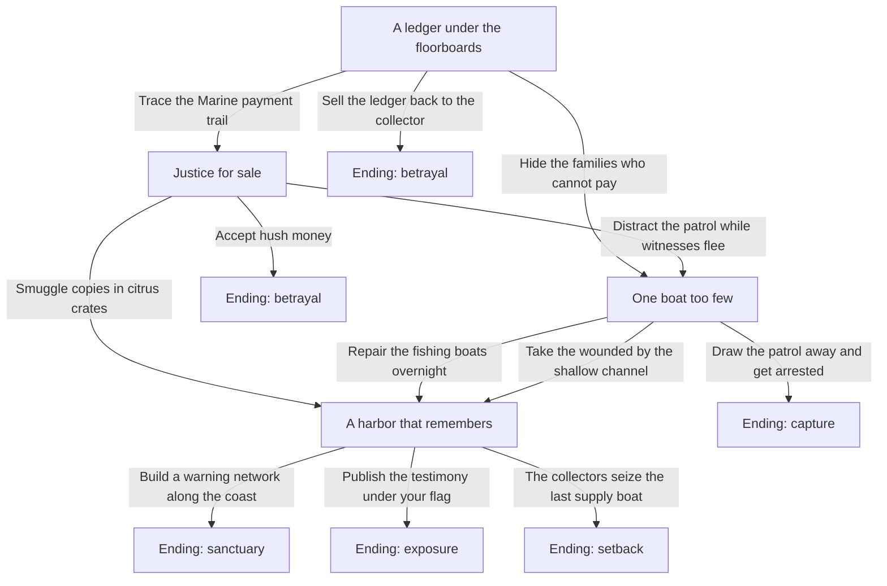
```mermaid
flowchart TD
  opening["A ledger under the floorboards"]
  opening -->|"Trace the Marine payment trail"| investigation
  opening -->|"Hide the families who cannot pay"| rescue
  opening -->|"Sell the ledger back to the collector"| opening_2["Ending: betrayal"]
  investigation["Justice for sale"]
  investigation -->|"Smuggle copies in citrus crates"| finale
  investigation -->|"Distract the patrol while witnesses flee"| rescue
  investigation -->|"Accept hush money"| investigation_2["Ending: betrayal"]
  rescue["One boat too few"]
  rescue -->|"Repair the fishing boats overnight"| finale
  rescue -->|"Take the wounded by the shallow channel"| finale
  rescue -->|"Draw the patrol away and get arrested"| rescue_2["Ending: capture"]
  finale["A harbor that remembers"]
  finale -->|"Build a warning network along the coast"| finale_0["Ending: sanctuary"]
  finale -->|"Publish the testimony under your flag"| finale_1["Ending: exposure"]
  finale -->|"The collectors seize the last supply boat"| finale_2["Ending: setback"]
```

### A ledger under the floorboards

A citrus seller entrusts you with a duplicate tribute ledger. A collector arrives before the ink is dry.

| Wheel result | What happens | Next scene | Mechanical consequence |
| --- | --- | --- | --- |
| Trace the Marine payment trail | A customs receipt ties the tribute to someone wearing a justice coat. | Justice for sale | Practice +8 Battle IQ; dream lead +1 |
| Hide the families who cannot pay | A storehouse becomes a refuge; every extra mouth strains its provisions. | One boat too few | Crew loyalty +5; trust +1; canon bond +1 |
| Sell the ledger back to the collector | You buy a quiet departure by exposing the seller. Nami will remember who profited. | Permanent ending | ฿20,000; crew loyalty −8; canon bond −2 |

### Justice for sale

The officer will destroy the evidence unless someone carries it past his checkpoint.

| Wheel result | What happens | Next scene | Mechanical consequence |
| --- | --- | --- | --- |
| Smuggle copies in citrus crates | Several merchants can now corroborate the same crime. | A harbor that remembers | Evidence +1; practice +5 Battle IQ |
| Distract the patrol while witnesses flee | The witnesses escape; the checkpoint leaves you with injuries. | One boat too few | Injury +1; trust +1 |
| Accept hush money | The officer pays, then burns the original. The village loses its strongest testimony. | Permanent ending | ฿20,000; crew loyalty −8; canon bond −2 |

### One boat too few

The hidden families need passage; a fisher refuses to abandon the oldest villagers.

| Wheel result | What happens | Next scene | Mechanical consequence |
| --- | --- | --- | --- |
| Repair the fishing boats overnight | The repair consumes your supplies, but no family must be divided. | A harbor that remembers | Spend up to ฿10,000; trust +1 |
| Take the wounded by the shallow channel | Local pilots mark a path an armed ship cannot follow. | A harbor that remembers | Crew loyalty +5; trust +1; canon bond +1 |
| Draw the patrol away and get arrested | The families reach the sea while you disappear into a branch prison. | Permanent ending | Captured; government heat +1 |

### A harbor that remembers

The villagers can turn scattered help into a lasting defense, but the collectors are returning.

| Wheel result | What happens | Next scene | Mechanical consequence |
| --- | --- | --- | --- |
| Build a warning network along the coast | Lookouts and fishing boats share signals. Collectors will never arrive unnoticed again. | Permanent ending | Legacy +2; crew loyalty +8; local refuge; canon bond +2 |
| Publish the testimony under your flag | Your name takes the blame; the village finally has witnesses beyond its shores. | Permanent ending | Dream leads +2; government heat +2; outlaw bounty +฿50,000 |
| The collectors seize the last supply boat | The resistance survives in secret, but this season’s supplies are gone. | Permanent ending | Lose up to ฿5,000; preserve the story in your journal |

## A meal owed to the sea

**Canon anchor:** Zeff and Sanji’s experience of starvation underlies Baratie’s commitment to feeding the hungry. [Source](https://one-piece.com/story/east_blue/index.html).

**Connected cast:** Zeff, Sanji.

**Where:** Baratie. **Starting eras:** Early Great Pirate Era, Summit War opening, New World opening.

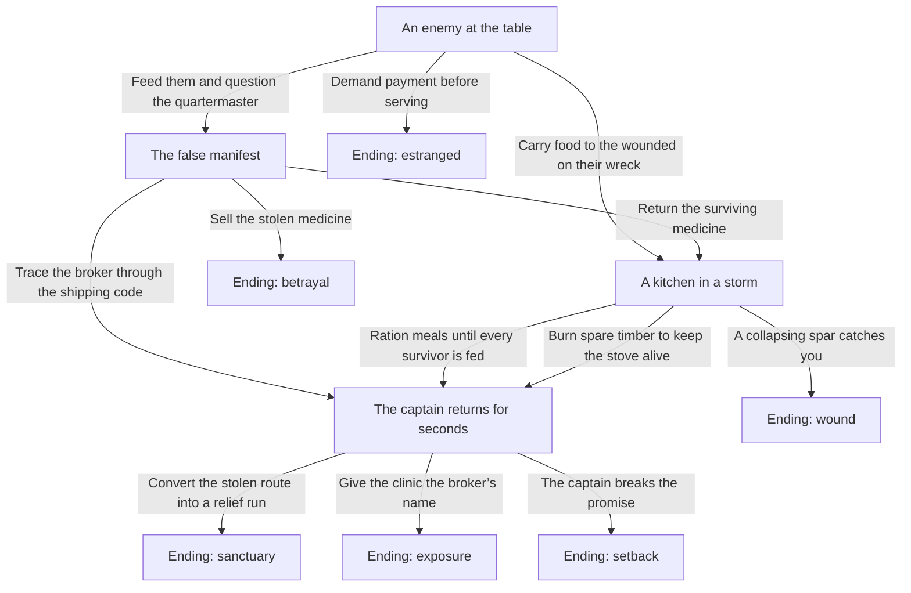
```mermaid
flowchart TD
  opening["An enemy at the table"]
  opening -->|"Feed them and question the quartermaster"| investigation
  opening -->|"Carry food to the wounded on their wreck"| rescue
  opening -->|"Demand payment before serving"| opening_2["Ending: estranged"]
  investigation["The false manifest"]
  investigation -->|"Trace the broker through the shipping code"| finale
  investigation -->|"Return the surviving medicine"| rescue
  investigation -->|"Sell the stolen medicine"| investigation_2["Ending: betrayal"]
  rescue["A kitchen in a storm"]
  rescue -->|"Ration meals until every survivor is fed"| finale
  rescue -->|"Burn spare timber to keep the stove alive"| finale
  rescue -->|"A collapsing spar catches you"| rescue_2["Ending: wound"]
  finale["The captain returns for seconds"]
  finale -->|"Convert the stolen route into a relief run"| finale_0["Ending: sanctuary"]
  finale -->|"Give the clinic the broker’s name"| finale_1["Ending: exposure"]
  finale -->|"The captain breaks the promise"| finale_2["Ending: setback"]
```

### An enemy at the table

Starving raiders wash against the restaurant. Their captain still wears stolen Marine insignia.

| Wheel result | What happens | Next scene | Mechanical consequence |
| --- | --- | --- | --- |
| Feed them and question the quartermaster | Zeff insists on a meal first. The quartermaster then admits the cargo was medicine. | The false manifest | Spend up to ฿10,000; trust +1 |
| Carry food to the wounded on their wreck | Sanji helps load the provisions; the wreck is taking water. | A kitchen in a storm | Crew loyalty +5; trust +1; canon bond +1 |
| Demand payment before serving | The raiders leave hungry. The cooks remember a debt you refused to recognize. | Permanent ending | Canon bond −1; promise ends |

### The false manifest

The raiders were paid to steal a shipment meant for an island clinic.

| Wheel result | What happens | Next scene | Mechanical consequence |
| --- | --- | --- | --- |
| Trace the broker through the shipping code | A delivery schedule identifies the next stolen shipment. | The captain returns for seconds | Evidence +1; practice +5 Battle IQ |
| Return the surviving medicine | A patient list gives every crate a human cost. | A kitchen in a storm | Crew loyalty +5; trust +1; canon bond +1 |
| Sell the stolen medicine | Your purse grows; the clinic’s empty shelves become your responsibility. | Permanent ending | ฿20,000; crew loyalty −8; canon bond −2 |

### A kitchen in a storm

You have a crowded lifeboat, a failing stove, and too few hands.

| Wheel result | What happens | Next scene | Mechanical consequence |
| --- | --- | --- | --- |
| Ration meals until every survivor is fed | Careful provisioning keeps both cooks and raiders standing. | The captain returns for seconds | Practice +8 Battle IQ; dream lead +1 |
| Burn spare timber to keep the stove alive | You trade saleable cargo for hot food and another night. | The captain returns for seconds | Spend up to ฿10,000; trust +1 |
| A collapsing spar catches you | The survivors get clear. You spend the following months recovering. | Permanent ending | Injury +1; trust +1 |

### The captain returns for seconds

The raiders must choose what sort of crew they become after being spared starvation.

| Wheel result | What happens | Next scene | Mechanical consequence |
| --- | --- | --- | --- |
| Convert the stolen route into a relief run | The restaurant becomes the first stop on an honest provisioning route. | Permanent ending | Legacy +2; crew loyalty +8; local refuge; canon bond +2 |
| Give the clinic the broker’s name | The theft is exposed and your involvement draws unwelcome attention. | Permanent ending | Dream leads +2; government heat +2; outlaw bounty +฿50,000 |
| The captain breaks the promise | The relief voyage never arrives. You preserve the names of those still waiting. | Permanent ending | Lose up to ฿5,000; preserve the story in your journal |

## Books that would not burn

**Canon anchor:** Ohara was destroyed for forbidden research; its scholars fought to preserve knowledge even as their home burned. [Source](https://one-piece.com/story/enies_lobby/index.html).

**Connected cast:** Nico Robin.

**Where:** Ohara. **Starting eras:** Early Great Pirate Era, Summit War opening, New World opening.

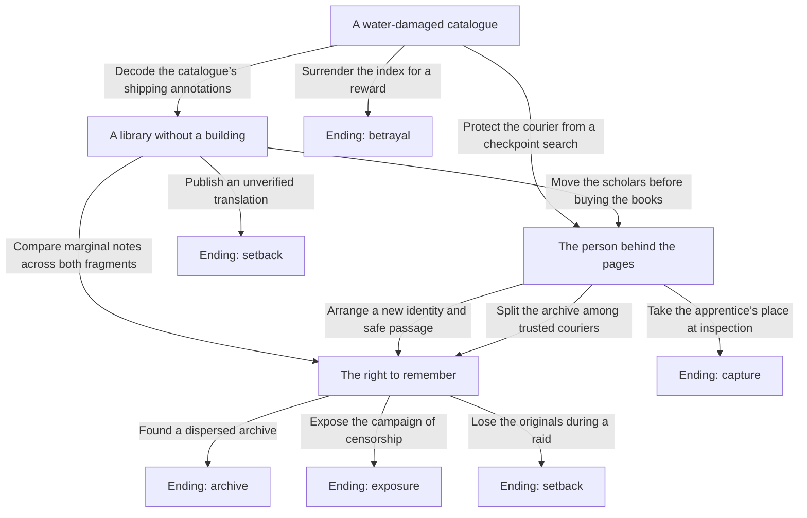
```mermaid
flowchart TD
  opening["A water-damaged catalogue"]
  opening -->|"Decode the catalogue’s shipping annotations"| investigation
  opening -->|"Protect the courier from a checkpoint search"| rescue
  opening -->|"Surrender the index for a reward"| opening_2["Ending: betrayal"]
  investigation["A library without a building"]
  investigation -->|"Compare marginal notes across both fragments"| finale
  investigation -->|"Move the scholars before buying the books"| rescue
  investigation -->|"Publish an unverified translation"| investigation_2["Ending: setback"]
  rescue["The person behind the pages"]
  rescue -->|"Arrange a new identity and safe passage"| finale
  rescue -->|"Split the archive among trusted couriers"| finale
  rescue -->|"Take the apprentice’s place at inspection"| rescue_2["Ending: capture"]
  finale["The right to remember"]
  finale -->|"Found a dispersed archive"| finale_0["Ending: archive"]
  finale -->|"Expose the campaign of censorship"| finale_1["Ending: exposure"]
  finale -->|"Lose the originals during a raid"| finale_2["Ending: setback"]
```

### A water-damaged catalogue

A refugee carries an index of books rescued from a condemned collection. The actual volumes are scattered among smugglers.

| Wheel result | What happens | Next scene | Mechanical consequence |
| --- | --- | --- | --- |
| Decode the catalogue’s shipping annotations | A librarian hid routes inside routine accession numbers. | A library without a building | Practice +8 Battle IQ; dream lead +1 |
| Protect the courier from a checkpoint search | The pages matter because someone survived to carry them. | The person behind the pages | Crew loyalty +5; trust +1; canon bond +1 |
| Surrender the index for a reward | The authorities pay promptly. A shelf of names vanishes with the catalogue. | Permanent ending | ฿20,000; crew loyalty −8; canon bond −2 |

### A library without a building

One seller offers a genuine fragment beside a convincing forgery.

| Wheel result | What happens | Next scene | Mechanical consequence |
| --- | --- | --- | --- |
| Compare marginal notes across both fragments | The disagreement reveals a later censor’s handwriting, not a new ancient truth. | The right to remember | Evidence +1; practice +5 Battle IQ |
| Move the scholars before buying the books | Safe lodging costs money but keeps the readers alive. | The person behind the pages | Spend up to ฿10,000; trust +1 |
| Publish an unverified translation | The false translation damages trust and gives the censors an easy rebuttal. | Permanent ending | Lose up to ฿5,000; preserve the story in your journal |

### The person behind the pages

A frightened apprentice wants to abandon the research to keep their family safe.

| Wheel result | What happens | Next scene | Mechanical consequence |
| --- | --- | --- | --- |
| Arrange a new identity and safe passage | The apprentice keeps a copy and gains time to decide freely. | The right to remember | Spend up to ฿10,000; trust +1 |
| Split the archive among trusted couriers | No single arrest can erase the collection now. | The right to remember | Evidence +1; practice +5 Battle IQ |
| Take the apprentice’s place at inspection | The archive travels on while your name enters a government file. | Permanent ending | Captured; government heat +1 |

### The right to remember

The surviving records need a custodian, not a claim that you have solved the Void Century.

| Wheel result | What happens | Next scene | Mechanical consequence |
| --- | --- | --- | --- |
| Found a dispersed archive | Copies, provenance notes, and cautious translations survive in separate harbors. | Permanent ending | Legacy +1; dream leads +2; lasting archive |
| Expose the campaign of censorship | You publish the evidence of suppression without pretending incomplete fragments tell the whole history. | Permanent ending | Dream leads +2; government heat +2; outlaw bounty +฿50,000 |
| Lose the originals during a raid | Your catalogue survives, but the lost pages will haunt every future reconstruction. | Permanent ending | Lose up to ฿5,000; preserve the story in your journal |

## The white town’s black ledger

**Canon anchor:** Flevance’s Amber Lead tragedy and Corazon’s sacrifice shaped Law’s life; Amber Lead poisoning was not a contagious plague. [Source](https://one-piece.com/story/dressrosa/index.html).

**Connected cast:** Trafalgar Law.

**Where:** Flevance Kingdom, Minion Island. **Starting eras:** Early Great Pirate Era, Summit War opening, New World opening.

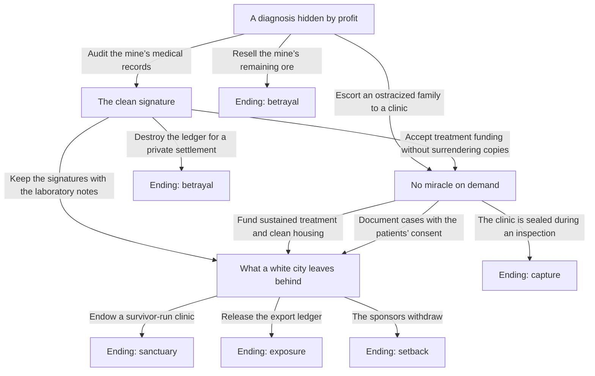
```mermaid
flowchart TD
  opening["A diagnosis hidden by profit"]
  opening -->|"Audit the mine’s medical records"| investigation
  opening -->|"Escort an ostracized family to a clinic"| rescue
  opening -->|"Resell the mine’s remaining ore"| opening_2["Ending: betrayal"]
  investigation["The clean signature"]
  investigation -->|"Keep the signatures with the laboratory notes"| finale
  investigation -->|"Accept treatment funding without surrendering copies"| rescue
  investigation -->|"Destroy the ledger for a private settlement"| investigation_2["Ending: betrayal"]
  rescue["No miracle on demand"]
  rescue -->|"Fund sustained treatment and clean housing"| finale
  rescue -->|"Document cases with the patients’ consent"| finale
  rescue -->|"The clinic is sealed during an inspection"| rescue_2["Ending: capture"]
  finale["What a white city leaves behind"]
  finale -->|"Endow a survivor-run clinic"| finale_0["Ending: sanctuary"]
  finale -->|"Release the export ledger"| finale_1["Ending: exposure"]
  finale -->|"The sponsors withdraw"| finale_2["Ending: setback"]
```

### A diagnosis hidden by profit

A mining ledger describes toxic exposure as a contagious illness. Survivors still face closed doors.

| Wheel result | What happens | Next scene | Mechanical consequence |
| --- | --- | --- | --- |
| Audit the mine’s medical records | The timing follows exposure at work, not contact between patients. | The clean signature | Practice +8 Battle IQ; dream lead +1 |
| Escort an ostracized family to a clinic | The family needs care and shelter before it can give testimony. | No miracle on demand | Crew loyalty +5; trust +1; canon bond +1 |
| Resell the mine’s remaining ore | A buyer ignores your warning. Another harbor inherits the danger. | Permanent ending | ฿20,000; crew loyalty −8; canon bond −2 |

### The clean signature

A company official offers to fund treatment if you omit the names that approved the exports.

| Wheel result | What happens | Next scene | Mechanical consequence |
| --- | --- | --- | --- |
| Keep the signatures with the laboratory notes | Responsibility cannot be separated from the records of exposure. | What a white city leaves behind | Evidence +1; practice +5 Battle IQ |
| Accept treatment funding without surrendering copies | A second archive protects the evidence while patients receive care. | No miracle on demand | Practice +8 Battle IQ; dream lead +1 |
| Destroy the ledger for a private settlement | One family is paid; the rest lose their chance to prove what happened. | Permanent ending | ฿20,000; crew loyalty −8; canon bond −2 |

### No miracle on demand

A doctor can manage symptoms, but an unknown patient cannot simply be promised Law’s rare power.

| Wheel result | What happens | Next scene | Mechanical consequence |
| --- | --- | --- | --- |
| Fund sustained treatment and clean housing | Recovery depends on repeated care, not one legendary intervention. | What a white city leaves behind | Spend up to ฿10,000; trust +1 |
| Document cases with the patients’ consent | Survivors choose which parts of their histories can be shared. | What a white city leaves behind | Evidence +1; practice +5 Battle IQ |
| The clinic is sealed during an inspection | You remain with the patients and are detained alongside them. | Permanent ending | Captured; government heat +1 |

### What a white city leaves behind

The survivors want both a future and a record of who profited from their suffering.

| Wheel result | What happens | Next scene | Mechanical consequence |
| --- | --- | --- | --- |
| Endow a survivor-run clinic | Clean housing and a permanent clinic outlast a one-time donation. | Permanent ending | Legacy +2; crew loyalty +8; local refuge; canon bond +2 |
| Release the export ledger | Ports begin rejecting the ore. The people named in the accounts want you silenced. | Permanent ending | Dream leads +2; government heat +2; outlaw bounty +฿50,000 |
| The sponsors withdraw | Treatment continues on a smaller scale, while the promised public inquiry collapses. | Permanent ending | Lose up to ฿5,000; preserve the story in your journal |

## Rain on a powder trail

**Canon anchor:** Crocodile and Baroque Works manipulated Alabasta’s drought and civil conflict while Vivi sought to stop the fighting. [Source](https://one-piece.com/story/alabasta/index.html).

**Connected cast:** Nefertari Vivi, Crocodile, Smoker.

**Where:** Alabasta Kingdom, Alubarna, Nanohana, Rainbase. **Starting eras:** Summit War opening, New World opening.

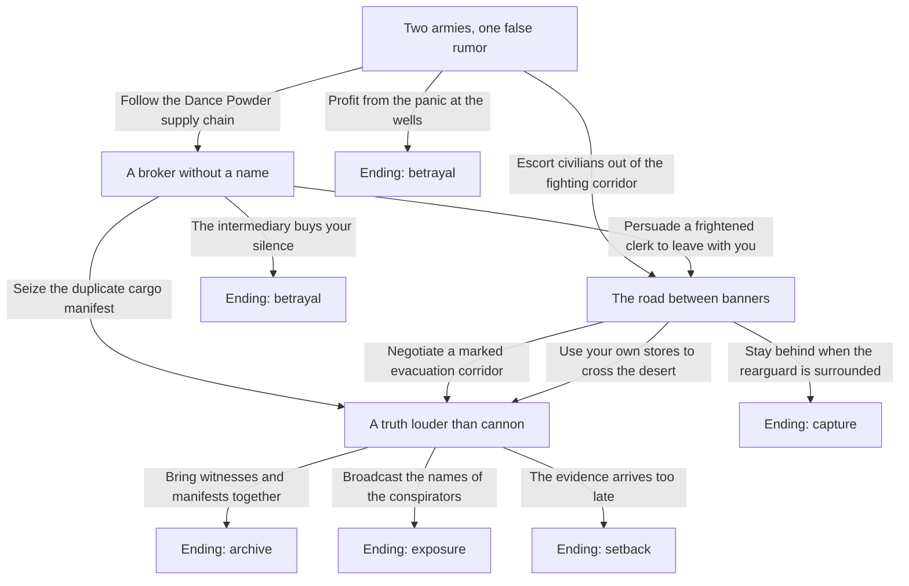
```mermaid
flowchart TD
  opening["Two armies, one false rumor"]
  opening -->|"Follow the Dance Powder supply chain"| investigation
  opening -->|"Escort civilians out of the fighting corridor"| rescue
  opening -->|"Profit from the panic at the wells"| opening_2["Ending: betrayal"]
  investigation["A broker without a name"]
  investigation -->|"Seize the duplicate cargo manifest"| finale
  investigation -->|"Persuade a frightened clerk to leave with you"| rescue
  investigation -->|"The intermediary buys your silence"| investigation_2["Ending: betrayal"]
  rescue["The road between banners"]
  rescue -->|"Negotiate a marked evacuation corridor"| finale
  rescue -->|"Use your own stores to cross the desert"| finale
  rescue -->|"Stay behind when the rearguard is surrounded"| rescue_2["Ending: capture"]
  finale["A truth louder than cannon"]
  finale -->|"Bring witnesses and manifests together"| finale_0["Ending: archive"]
  finale -->|"Broadcast the names of the conspirators"| finale_1["Ending: exposure"]
  finale -->|"The evidence arrives too late"| finale_2["Ending: setback"]
```

### Two armies, one false rumor

A water convoy is blamed for stealing rain. Vivi’s contact needs proof before the rumor becomes a massacre.

| Wheel result | What happens | Next scene | Mechanical consequence |
| --- | --- | --- | --- |
| Follow the Dance Powder supply chain | The crates bear a port mark used by a shell company. | A broker without a name | Practice +8 Battle IQ; dream lead +1 |
| Escort civilians out of the fighting corridor | Both sides accuse your convoy of sheltering spies. | The road between banners | Crew loyalty +5; trust +1; canon bond +1 |
| Profit from the panic at the wells | Your water sells at a fortune. The empty cups have faces you will remember. | Permanent ending | ฿20,000; crew loyalty −8; canon bond −2 |

### A broker without a name

A Baroque Works intermediary orders the last documents burned.

| Wheel result | What happens | Next scene | Mechanical consequence |
| --- | --- | --- | --- |
| Seize the duplicate cargo manifest | The forged seals link several supposedly independent shipments. | A truth louder than cannon | Evidence +1; practice +5 Battle IQ |
| Persuade a frightened clerk to leave with you | A living witness can explain what the numbers conceal. | The road between banners | Crew loyalty +5; trust +1; canon bond +1 |
| The intermediary buys your silence | The conspiracy keeps its cover and gains another paid accomplice. | Permanent ending | ฿20,000; crew loyalty −8; canon bond −2 |

### The road between banners

Civilians are trapped between armed columns that each believe the other poisoned the wells.

| Wheel result | What happens | Next scene | Mechanical consequence |
| --- | --- | --- | --- |
| Negotiate a marked evacuation corridor | Neutral water bearers carry the agreement to both commanders. | A truth louder than cannon | Practice +8 Battle IQ; dream lead +1 |
| Use your own stores to cross the desert | The journey empties your hold but preserves the convoy. | A truth louder than cannon | Spend up to ฿10,000; trust +1 |
| Stay behind when the rearguard is surrounded | The refugees reach shelter; you become a bargaining piece. | Permanent ending | Captured; government heat +1 |

### A truth louder than cannon

The armies need a reason to stop before the next volley.

| Wheel result | What happens | Next scene | Mechanical consequence |
| --- | --- | --- | --- |
| Bring witnesses and manifests together | The evidence survives public scrutiny and helps local leaders dismantle the lie. | Permanent ending | Legacy +1; dream leads +2; lasting archive |
| Broadcast the names of the conspirators | Your transmission interrupts the propaganda and puts a price on your interference. | Permanent ending | Dream leads +2; government heat +2; outlaw bounty +฿50,000 |
| The evidence arrives too late | You preserve it for an inquiry, but cannot undo the casualties of this battle. | Permanent ending | Lose up to ฿5,000; preserve the story in your journal |

## The bell beneath the clouds

**Canon anchor:** Shandora’s history connects the sky island conflict to Noland’s promise; the golden bell is more than treasure. [Source](https://one-piece.com/story/skypiea/index.html).

**Connected cast:** Nico Robin, Nami.

**Where:** Skypiea, Upper Yard, Jaya. **Starting eras:** Summit War opening, New World opening.

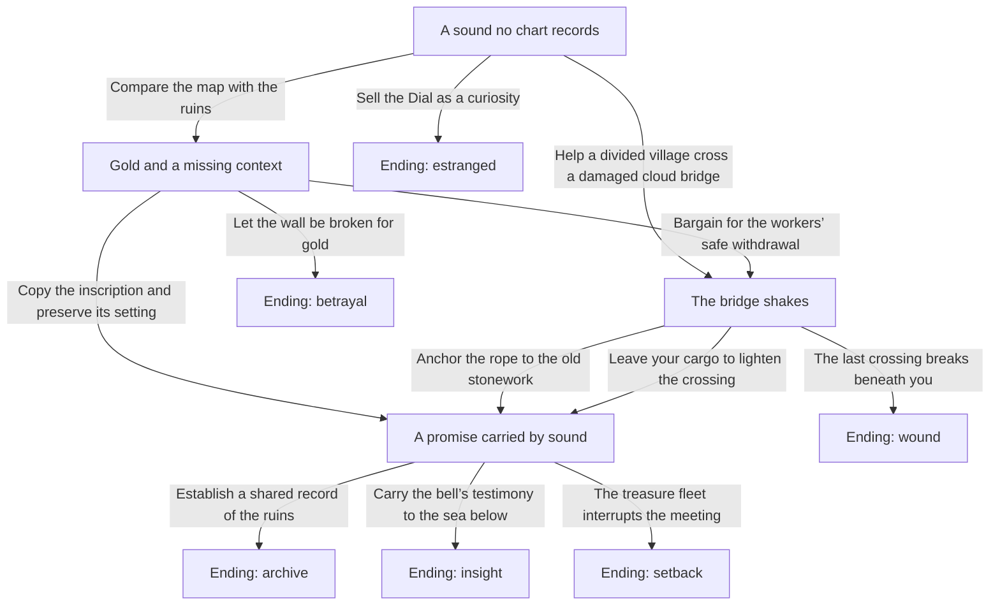
```mermaid
flowchart TD
  opening["A sound no chart records"]
  opening -->|"Compare the map with the ruins"| investigation
  opening -->|"Help a divided village cross a damaged cloud bridge"| rescue
  opening -->|"Sell the Dial as a curiosity"| opening_2["Ending: estranged"]
  investigation["Gold and a missing context"]
  investigation -->|"Copy the inscription and preserve its setting"| finale
  investigation -->|"Bargain for the workers’ safe withdrawal"| rescue
  investigation -->|"Let the wall be broken for gold"| investigation_2["Ending: betrayal"]
  rescue["The bridge shakes"]
  rescue -->|"Anchor the rope to the old stonework"| finale
  rescue -->|"Leave your cargo to lighten the crossing"| finale
  rescue -->|"The last crossing breaks beneath you"| rescue_2["Ending: wound"]
  finale["A promise carried by sound"]
  finale -->|"Establish a shared record of the ruins"| finale_0["Ending: archive"]
  finale -->|"Carry the bell’s testimony to the sea below"| finale_1["Ending: insight"]
  finale -->|"The treasure fleet interrupts the meeting"| finale_2["Ending: setback"]
```

### A sound no chart records

A sky trader has a Dial carrying a broken bell tone and a map annotated in two different traditions.

| Wheel result | What happens | Next scene | Mechanical consequence |
| --- | --- | --- | --- |
| Compare the map with the ruins | The old coastline fits a piece of land that no longer lies at sea level. | Gold and a missing context | Practice +8 Battle IQ; dream lead +1 |
| Help a divided village cross a damaged cloud bridge | The evacuation puts rival families on the same rope. | The bridge shakes | Crew loyalty +5; trust +1; canon bond +1 |
| Sell the Dial as a curiosity | The recording disappears into a collector’s vault before anyone hears its meaning. | Permanent ending | Canon bond −1; promise ends |

### Gold and a missing context

A treasure crew wants to strip a carved wall for its ornaments.

| Wheel result | What happens | Next scene | Mechanical consequence |
| --- | --- | --- | --- |
| Copy the inscription and preserve its setting | The location matters as much as the marks; a rubbing alone cannot translate itself. | A promise carried by sound | Evidence +1; practice +5 Battle IQ |
| Bargain for the workers’ safe withdrawal | You pay to prevent a violent clash at the ruins. | The bridge shakes | Spend up to ฿10,000; trust +1 |
| Let the wall be broken for gold | Your share is heavy. The historical context is irretrievable. | Permanent ending | ฿20,000; crew loyalty −8; canon bond −2 |

### The bridge shakes

A cloud current shifts while the youngest evacuees are halfway across.

| Wheel result | What happens | Next scene | Mechanical consequence |
| --- | --- | --- | --- |
| Anchor the rope to the old stonework | The ruins become shelter rather than a prize. | A promise carried by sound | Practice +8 Battle IQ; dream lead +1 |
| Leave your cargo to lighten the crossing | The bridge holds with people aboard and treasure behind. | A promise carried by sound | Spend up to ฿10,000; trust +1 |
| The last crossing breaks beneath you | Rescuers pull you free after everyone else has crossed. | Permanent ending | Injury +1; trust +1 |

### A promise carried by sound

The competing stories can be heard together if someone protects the gathering.

| Wheel result | What happens | Next scene | Mechanical consequence |
| --- | --- | --- | --- |
| Establish a shared record of the ruins | Both communities retain their names for the same places. | Permanent ending | Legacy +1; dream leads +2; lasting archive |
| Carry the bell’s testimony to the sea below | A navigator gains a lead connecting sky and sea without claiming every mystery is solved. | Permanent ending | Practice +8 Battle IQ; dream lead +1 |
| The treasure fleet interrupts the meeting | The recording survives, but reconciliation must wait for safer skies. | Permanent ending | Lose up to ฿5,000; preserve the story in your journal |

## The last train before Aqua Laguna

**Canon anchor:** Water 7’s shipwrights, CP9’s infiltration, and Robin’s capture lead into the confrontation at Enies Lobby. [Source](https://one-piece.com/story/enies_lobby/index.html).

**Connected cast:** Franky, Nico Robin, Rob Lucci.

**Where:** Water Seven, Enies Lobby, San Faldo. **Starting eras:** Summit War opening, New World opening.

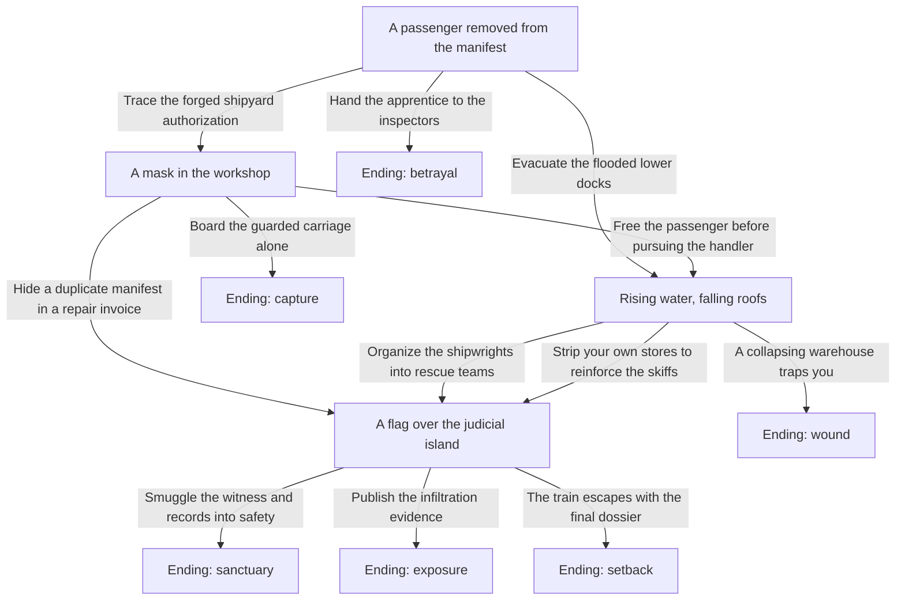
```mermaid
flowchart TD
  opening["A passenger removed from the manifest"]
  opening -->|"Trace the forged shipyard authorization"| investigation
  opening -->|"Evacuate the flooded lower docks"| rescue
  opening -->|"Hand the apprentice to the inspectors"| opening_2["Ending: betrayal"]
  investigation["A mask in the workshop"]
  investigation -->|"Hide a duplicate manifest in a repair invoice"| finale
  investigation -->|"Free the passenger before pursuing the handler"| rescue
  investigation -->|"Board the guarded carriage alone"| investigation_2["Ending: capture"]
  rescue["Rising water, falling roofs"]
  rescue -->|"Organize the shipwrights into rescue teams"| finale
  rescue -->|"Strip your own stores to reinforce the skiffs"| finale
  rescue -->|"A collapsing warehouse traps you"| rescue_2["Ending: wound"]
  finale["A flag over the judicial island"]
  finale -->|"Smuggle the witness and records into safety"| finale_0["Ending: sanctuary"]
  finale -->|"Publish the infiltration evidence"| finale_1["Ending: exposure"]
  finale -->|"The train escapes with the final dossier"| finale_2["Ending: setback"]
```

### A passenger removed from the manifest

A shipyard apprentice copies a classified rail manifest. Their mentor disappears before the evening tide.

| Wheel result | What happens | Next scene | Mechanical consequence |
| --- | --- | --- | --- |
| Trace the forged shipyard authorization | An insider knew which seal would pass without a second glance. | A mask in the workshop | Practice +8 Battle IQ; dream lead +1 |
| Evacuate the flooded lower docks | The storm is a threat even to people with no part in the conspiracy. | Rising water, falling roofs | Crew loyalty +5; trust +1; canon bond +1 |
| Hand the apprentice to the inspectors | The inspectors commend your cooperation and confiscate every copy they find. | Permanent ending | ฿20,000; crew loyalty −8; canon bond −2 |

### A mask in the workshop

The forged order leads to a sealed compartment on the last train.

| Wheel result | What happens | Next scene | Mechanical consequence |
| --- | --- | --- | --- |
| Hide a duplicate manifest in a repair invoice | An ordinary shipwright’s bill gets the evidence past the sweep. | A flag over the judicial island | Evidence +1; practice +5 Battle IQ |
| Free the passenger before pursuing the handler | You gain a witness but pay for the escape with a serious fall. | Rising water, falling roofs | Injury +1; trust +1 |
| Board the guarded carriage alone | The guards lock the carriage before the train clears the station. | Permanent ending | Captured; government heat +1 |

### Rising water, falling roofs

Dockworkers and a captive witness need the same scarce rescue skiffs.

| Wheel result | What happens | Next scene | Mechanical consequence |
| --- | --- | --- | --- |
| Organize the shipwrights into rescue teams | Their knowledge of the canals saves time that strength alone would waste. | A flag over the judicial island | Crew loyalty +5; trust +1; canon bond +1 |
| Strip your own stores to reinforce the skiffs | Your voyage loses supplies; the skiffs gain another trip. | A flag over the judicial island | Spend up to ฿10,000; trust +1 |
| A collapsing warehouse traps you | The rescue teams return for you after the last civilian is clear. | Permanent ending | Injury +1; trust +1 |

### A flag over the judicial island

Your local rescue intersects with a government willing to erase witnesses.

| Wheel result | What happens | Next scene | Mechanical consequence |
| --- | --- | --- | --- |
| Smuggle the witness and records into safety | A safe berth and several copies survive the official denial. | Permanent ending | Legacy +2; crew loyalty +8; local refuge; canon bond +2 |
| Publish the infiltration evidence | Shipyards tighten their trust while government agents add your name to their search. | Permanent ending | Dream leads +2; government heat +2; outlaw bounty +฿50,000 |
| The train escapes with the final dossier | You save people but lose the paper trail identifying the operation’s sponsors. | Permanent ending | Lose up to ฿5,000; preserve the story in your journal |

## Lot number zero

**Canon anchor:** Sabaody’s human auction exposes the violence of the slave trade and the protection afforded to Celestial Dragons. [Source](https://one-piece.com/story/sabaody/index.html).

**Connected cast:** Silvers Rayleigh, Boa Hancock, Borsalino.

**Where:** Sabaody Archipelago. **Starting eras:** Summit War opening, New World opening.

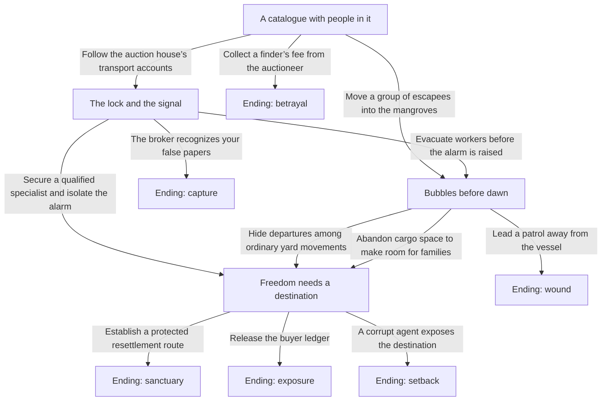
```mermaid
flowchart TD
  opening["A catalogue with people in it"]
  opening -->|"Follow the auction house’s transport accounts"| investigation
  opening -->|"Move a group of escapees into the mangroves"| rescue
  opening -->|"Collect a finder’s fee from the auctioneer"| opening_2["Ending: betrayal"]
  investigation["The lock and the signal"]
  investigation -->|"Secure a qualified specialist and isolate the alarm"| finale
  investigation -->|"Evacuate workers before the alarm is raised"| rescue
  investigation -->|"The broker recognizes your false papers"| investigation_2["Ending: capture"]
  rescue["Bubbles before dawn"]
  rescue -->|"Hide departures among ordinary yard movements"| finale
  rescue -->|"Abandon cargo space to make room for families"| finale
  rescue -->|"Lead a patrol away from the vessel"| rescue_2["Ending: wound"]
  finale["Freedom needs a destination"]
  finale -->|"Establish a protected resettlement route"| finale_0["Ending: sanctuary"]
  finale -->|"Release the buyer ledger"| finale_1["Ending: exposure"]
  finale -->|"A corrupt agent exposes the destination"| finale_2["Ending: setback"]
```

### A catalogue with people in it

A coating-yard worker identifies a missing friend in an auction catalogue. The sale begins at sundown.

| Wheel result | What happens | Next scene | Mechanical consequence |
| --- | --- | --- | --- |
| Follow the auction house’s transport accounts | The accounts reveal holding pens beyond the public showroom. | The lock and the signal | Practice +8 Battle IQ; dream lead +1 |
| Move a group of escapees into the mangroves | The workers know channels the patrol launches cannot enter. | Bubbles before dawn | Crew loyalty +5; trust +1; canon bond +1 |
| Collect a finder’s fee from the auctioneer | The payment buys another lock for the holding pens. | Permanent ending | ฿20,000; crew loyalty −8; canon bond −2 |

### The lock and the signal

Removing a collar without understanding its mechanism can kill the person you mean to save.

| Wheel result | What happens | Next scene | Mechanical consequence |
| --- | --- | --- | --- |
| Secure a qualified specialist and isolate the alarm | Preparation makes a coordinated release possible; the collars are never treated as harmless jewelry. | Freedom needs a destination | Evidence +1; practice +5 Battle IQ |
| Evacuate workers before the alarm is raised | A silent departure protects people who cannot survive an admiral’s intervention. | Bubbles before dawn | Spend up to ฿10,000; trust +1 |
| The broker recognizes your false papers | The forged pass becomes evidence against you. | Permanent ending | Captured; government heat +1 |

### Bubbles before dawn

A coated vessel can carry the escapees if the harbor agents do not identify it.

| Wheel result | What happens | Next scene | Mechanical consequence |
| --- | --- | --- | --- |
| Hide departures among ordinary yard movements | Shipwrights lend routine paperwork without naming the passengers. | Freedom needs a destination | Practice +8 Battle IQ; dream lead +1 |
| Abandon cargo space to make room for families | Every extra berth costs profit and prevents a separation. | Freedom needs a destination | Spend up to ฿10,000; trust +1 |
| Lead a patrol away from the vessel | The ship slips out while you recover from the pursuit. | Permanent ending | Injury +1; trust +1 |

### Freedom needs a destination

The escapees need homes and identities after the exhilarating first night.

| Wheel result | What happens | Next scene | Mechanical consequence |
| --- | --- | --- | --- |
| Establish a protected resettlement route | The coating yard becomes the first link in a continuing escape network. | Permanent ending | Legacy +2; crew loyalty +8; local refuge; canon bond +2 |
| Release the buyer ledger | The people who paid for prisoners discover that their names are no longer private. | Permanent ending | Dream leads +2; government heat +2; outlaw bounty +฿50,000 |
| A corrupt agent exposes the destination | The network relocates; the people remain free but lose their first safe harbor. | Permanent ending | Lose up to ฿5,000; preserve the story in your journal |

## Letters from the frozen bay

**Canon anchor:** Ace’s execution draws Whitebeard’s fleet to Marineford; the war destroys lives far beyond the strongest combatants. [Source](https://one-piece.com/story/marineford/index.html).

**Connected cast:** Portgas D. Ace, Edward Newgate, Koby.

**Where:** Marineford, Impel Down, Sabaody Archipelago. **Starting eras:** Summit War opening.

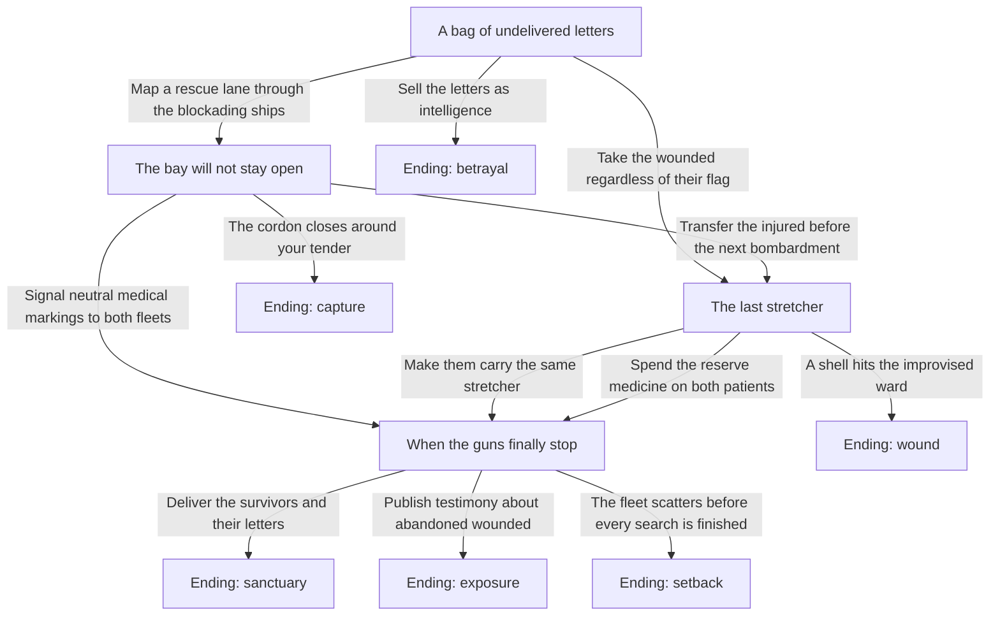
```mermaid
flowchart TD
  opening["A bag of undelivered letters"]
  opening -->|"Map a rescue lane through the blockading ships"| investigation
  opening -->|"Take the wounded regardless of their flag"| rescue
  opening -->|"Sell the letters as intelligence"| opening_2["Ending: betrayal"]
  investigation["The bay will not stay open"]
  investigation -->|"Signal neutral medical markings to both fleets"| finale
  investigation -->|"Transfer the injured before the next bombardment"| rescue
  investigation -->|"The cordon closes around your tender"| investigation_2["Ending: capture"]
  rescue["The last stretcher"]
  rescue -->|"Make them carry the same stretcher"| finale
  rescue -->|"Spend the reserve medicine on both patients"| finale
  rescue -->|"A shell hits the improvised ward"| rescue_2["Ending: wound"]
  finale["When the guns finally stop"]
  finale -->|"Deliver the survivors and their letters"| finale_0["Ending: sanctuary"]
  finale -->|"Publish testimony about abandoned wounded"| finale_1["Ending: exposure"]
  finale -->|"The fleet scatters before every search is finished"| finale_2["Ending: setback"]
```

### A bag of undelivered letters

A medical tender seeks volunteers as the execution becomes a fleet-wide emergency. The letters belong to both sides.

| Wheel result | What happens | Next scene | Mechanical consequence |
| --- | --- | --- | --- |
| Map a rescue lane through the blockading ships | A tide table offers a small opening between patrol rotations. | The bay will not stay open | Practice +8 Battle IQ; dream lead +1 |
| Take the wounded regardless of their flag | The first rescued sailor points you toward someone from the opposing side. | The last stretcher | Crew loyalty +5; trust +1; canon bond +1 |
| Sell the letters as intelligence | Families become bargaining chips in a war they cannot stop. | Permanent ending | ฿20,000; crew loyalty −8; canon bond −2 |

### The bay will not stay open

A route that was safe at dawn is now exposed to artillery.

| Wheel result | What happens | Next scene | Mechanical consequence |
| --- | --- | --- | --- |
| Signal neutral medical markings to both fleets | Several captains acknowledge the channel, though no guarantee can bind every gunner. | When the guns finally stop | Evidence +1; practice +5 Battle IQ |
| Transfer the injured before the next bombardment | You leave valuable equipment behind to free deck space. | The last stretcher | Spend up to ฿10,000; trust +1 |
| The cordon closes around your tender | Your medical mission survives in testimony while you face detention. | Permanent ending | Captured; government heat +1 |

### The last stretcher

A Marine and a pirate each demand that you leave the other behind.

| Wheel result | What happens | Next scene | Mechanical consequence |
| --- | --- | --- | --- |
| Make them carry the same stretcher | Cooperation begins with a person neither can lift alone. | When the guns finally stop | Crew loyalty +5; trust +1; canon bond +1 |
| Spend the reserve medicine on both patients | You sail home with empty cabinets and living passengers. | When the guns finally stop | Spend up to ฿10,000; trust +1 |
| A shell hits the improvised ward | The evacuation continues while others treat your injuries. | Permanent ending | Injury +1; trust +1 |

### When the guns finally stop

The war’s canonical tragedy is the anchor; your mission determines who receives help around its edges.

| Wheel result | What happens | Next scene | Mechanical consequence |
| --- | --- | --- | --- |
| Deliver the survivors and their letters | Several families receive a living messenger instead of a casualty notice. | Permanent ending | Legacy +2; crew loyalty +8; local refuge; canon bond +2 |
| Publish testimony about abandoned wounded | Your account refuses to sort suffering by allegiance. | Permanent ending | Dream leads +2; government heat +2; outlaw bounty +฿50,000 |
| The fleet scatters before every search is finished | You preserve a list of the missing rather than inventing reassuring answers. | Permanent ending | Lose up to ฿5,000; preserve the story in your journal |

## Sunlight beneath ten thousand meters

**Canon anchor:** Fish-Man Island’s struggle for dignity is tied to Otohime’s diplomacy, Fisher Tiger’s liberation of slaves, and inherited prejudice. [Source](https://one-piece.com/story/fishman_island/index.html).

**Connected cast:** Jinbe, Boa Hancock.

**Where:** Fish-Man Island. **Starting eras:** Summit War opening, New World opening.

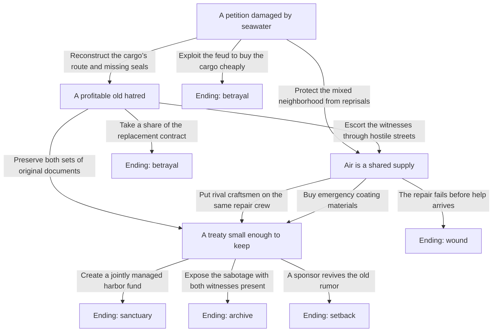
```mermaid
flowchart TD
  opening["A petition damaged by seawater"]
  opening -->|"Reconstruct the cargo’s route and missing seals"| investigation
  opening -->|"Protect the mixed neighborhood from reprisals"| rescue
  opening -->|"Exploit the feud to buy the cargo cheaply"| opening_2["Ending: betrayal"]
  investigation["A profitable old hatred"]
  investigation -->|"Preserve both sets of original documents"| finale
  investigation -->|"Escort the witnesses through hostile streets"| rescue
  investigation -->|"Take a share of the replacement contract"| investigation_2["Ending: betrayal"]
  rescue["Air is a shared supply"]
  rescue -->|"Put rival craftsmen on the same repair crew"| finale
  rescue -->|"Buy emergency coating materials"| finale
  rescue -->|"The repair fails before help arrives"| rescue_2["Ending: wound"]
  finale["A treaty small enough to keep"]
  finale -->|"Create a jointly managed harbor fund"| finale_0["Ending: sanctuary"]
  finale -->|"Expose the sabotage with both witnesses present"| finale_1["Ending: archive"]
  finale -->|"A sponsor revives the old rumor"| finale_2["Ending: setback"]
```

### A petition damaged by seawater

A human merchant and a fish-man dockworker each insist that the other sabotaged a shared shipment.

| Wheel result | What happens | Next scene | Mechanical consequence |
| --- | --- | --- | --- |
| Reconstruct the cargo’s route and missing seals | A third party altered the paperwork at the surface port. | A profitable old hatred | Practice +8 Battle IQ; dream lead +1 |
| Protect the mixed neighborhood from reprisals | The first safe house is a workshop where both communities already work together. | Air is a shared supply | Crew loyalty +5; trust +1; canon bond +1 |
| Exploit the feud to buy the cargo cheaply | The bargain deepens a grievance others will have to live with. | Permanent ending | ฿20,000; crew loyalty −8; canon bond −2 |

### A profitable old hatred

The saboteur earns a commission whenever surface-undersea trade fails.

| Wheel result | What happens | Next scene | Mechanical consequence |
| --- | --- | --- | --- |
| Preserve both sets of original documents | Matching signatures undermine the story told to each side. | A treaty small enough to keep | Evidence +1; practice +5 Battle IQ |
| Escort the witnesses through hostile streets | Their testimony survives an attack meant to silence it. | Air is a shared supply | Injury +1; trust +1 |
| Take a share of the replacement contract | You become another reason reconciliation appears impossible. | Permanent ending | ฿20,000; crew loyalty −8; canon bond −2 |

### Air is a shared supply

A damaged bubble shelter forces hostile neighbors to share repairs.

| Wheel result | What happens | Next scene | Mechanical consequence |
| --- | --- | --- | --- |
| Put rival craftsmen on the same repair crew | Each learns whose work kept the children breathing. | A treaty small enough to keep | Crew loyalty +5; trust +1; canon bond +1 |
| Buy emergency coating materials | An expensive repair prevents a neighborhood evacuation. | A treaty small enough to keep | Spend up to ฿10,000; trust +1 |
| The repair fails before help arrives | A rescue team reaches you after a dangerous loss of air. | Permanent ending | Injury +1; trust +1 |

### A treaty small enough to keep

A single trade route cannot erase centuries of injustice; it can become a promise people can check.

| Wheel result | What happens | Next scene | Mechanical consequence |
| --- | --- | --- | --- |
| Create a jointly managed harbor fund | Both communities control repairs and can inspect how the money is spent. | Permanent ending | Legacy +2; crew loyalty +8; local refuge; canon bond +2 |
| Expose the sabotage with both witnesses present | The shared record prevents either community from being written out of the truth. | Permanent ending | Legacy +1; dream leads +2; lasting archive |
| A sponsor revives the old rumor | The agreement stalls, though the repair crew continues meeting in private. | Permanent ending | Lose up to ฿5,000; preserve the story in your journal |

## The names the toys remember

**Canon anchor:** Sugar’s power turns people into toys and erases others’ memories of them; Dressrosa’s hidden labor system serves Doflamingo. [Source](https://one-piece.com/story/dressrosa/index.html).

**Connected cast:** Nico Robin, Trafalgar Law, Donquixote Doflamingo.

**Where:** Dressrosa Kingdom, Green Bit. **Starting eras:** New World opening.

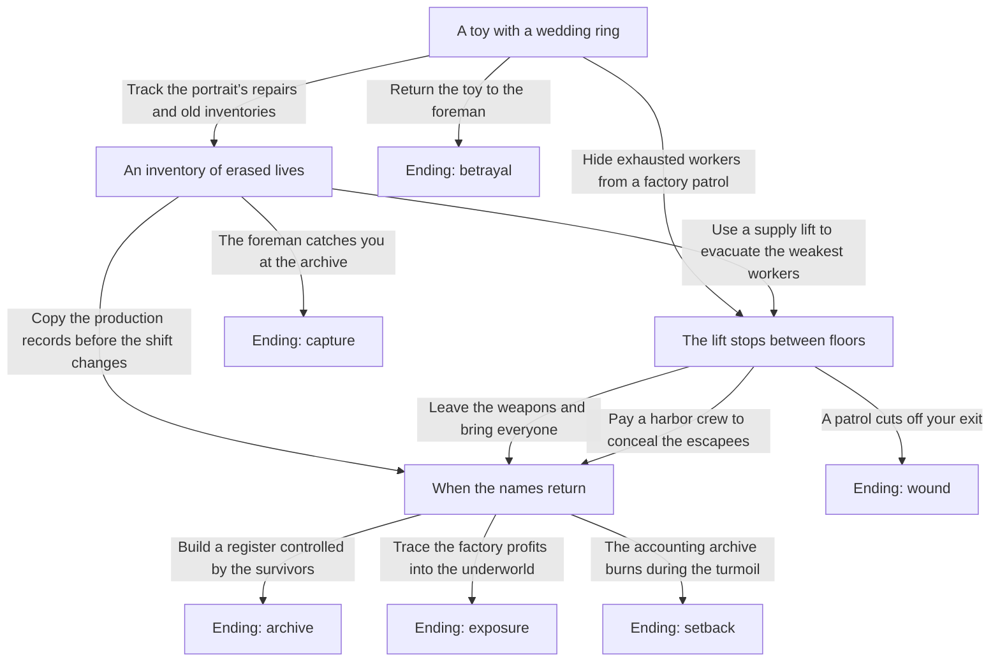
```mermaid
flowchart TD
  opening["A toy with a wedding ring"]
  opening -->|"Track the portrait’s repairs and old inventories"| investigation
  opening -->|"Hide exhausted workers from a factory patrol"| rescue
  opening -->|"Return the toy to the foreman"| opening_2["Ending: betrayal"]
  investigation["An inventory of erased lives"]
  investigation -->|"Copy the production records before the shift changes"| finale
  investigation -->|"Use a supply lift to evacuate the weakest workers"| rescue
  investigation -->|"The foreman catches you at the archive"| investigation_2["Ending: capture"]
  rescue["The lift stops between floors"]
  rescue -->|"Leave the weapons and bring everyone"| finale
  rescue -->|"Pay a harbor crew to conceal the escapees"| finale
  rescue -->|"A patrol cuts off your exit"| rescue_2["Ending: wound"]
  finale["When the names return"]
  finale -->|"Build a register controlled by the survivors"| finale_0["Ending: archive"]
  finale -->|"Trace the factory profits into the underworld"| finale_1["Ending: exposure"]
  finale -->|"The accounting archive burns during the turmoil"| finale_2["Ending: setback"]
```

### A toy with a wedding ring

A damaged toy insists a family portrait once contained another person. The empty space is not proof anyone else can remember.

| Wheel result | What happens | Next scene | Mechanical consequence |
| --- | --- | --- | --- |
| Track the portrait’s repairs and old inventories | Material inconsistencies remain even where personal memory fails. | An inventory of erased lives | Practice +8 Battle IQ; dream lead +1 |
| Hide exhausted workers from a factory patrol | Their immediate need is shelter, whatever the world remembers about them. | The lift stops between floors | Crew loyalty +5; trust +1; canon bond +1 |
| Return the toy to the foreman | A missing person becomes another repaired asset on a production list. | Permanent ending | ฿20,000; crew loyalty −8; canon bond −2 |

### An inventory of erased lives

The factory’s quotas count workers its public registers say do not exist.

| Wheel result | What happens | Next scene | Mechanical consequence |
| --- | --- | --- | --- |
| Copy the production records before the shift changes | The contradiction is measurable even without recovered memories. | When the names return | Evidence +1; practice +5 Battle IQ |
| Use a supply lift to evacuate the weakest workers | Your cargo allowance becomes space for living witnesses. | The lift stops between floors | Spend up to ฿10,000; trust +1 |
| The foreman catches you at the archive | The records remain locked while you join the prisoners. | Permanent ending | Captured; government heat +1 |

### The lift stops between floors

The escape route has room for people or contraband weapons, but not both.

| Wheel result | What happens | Next scene | Mechanical consequence |
| --- | --- | --- | --- |
| Leave the weapons and bring everyone | The workers see exactly what their lives were worth to you. | When the names return | Crew loyalty +5; trust +1; canon bond +1 |
| Pay a harbor crew to conceal the escapees | Your route ends in a fishing loft with enough beds. | When the names return | Spend up to ฿10,000; trust +1 |
| A patrol cuts off your exit | You hold the lift long enough for the last workers to leave. | Permanent ending | Injury +1; trust +1 |

### When the names return

In this alternate mission, evidence and community decide how victims reclaim their place; you do not gain Sugar’s power.

| Wheel result | What happens | Next scene | Mechanical consequence |
| --- | --- | --- | --- |
| Build a register controlled by the survivors | Each survivor can correct the record and decide how their story is used. | Permanent ending | Legacy +1; dream leads +2; lasting archive |
| Trace the factory profits into the underworld | The records expose buyers beyond Dressrosa and make you their problem. | Permanent ending | Dream leads +2; government heat +2; outlaw bounty +฿50,000 |
| The accounting archive burns during the turmoil | The survivors remain, but many claims now depend on testimony alone. | Permanent ending | Lose up to ฿5,000; preserve the story in your journal |

## An invitation written in sugar

**Canon anchor:** Big Mom’s political marriages and Sanji’s coerced wedding turn a celebration into a struggle over family, power, and escape. [Source](https://one-piece.com/story/wholecakeisland/index.html).

**Connected cast:** Sanji, Capone Bege, Charlotte Katakuri.

**Where:** Whole Cake Island, Cacao. **Starting eras:** New World opening.

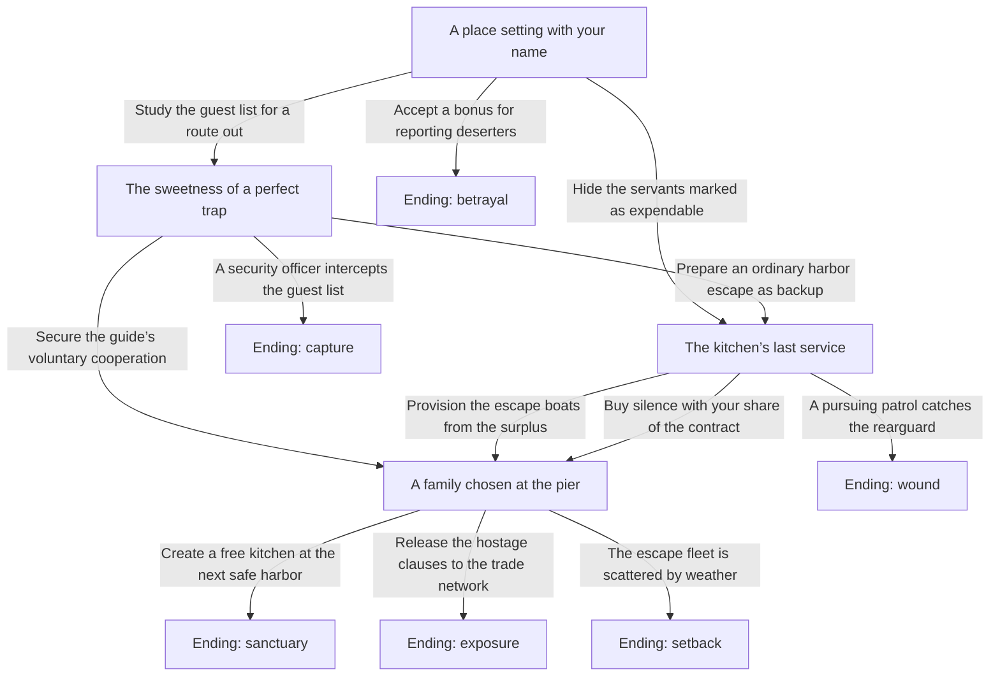
```mermaid
flowchart TD
  opening["A place setting with your name"]
  opening -->|"Study the guest list for a route out"| investigation
  opening -->|"Hide the servants marked as expendable"| rescue
  opening -->|"Accept a bonus for reporting deserters"| opening_2["Ending: betrayal"]
  investigation["The sweetness of a perfect trap"]
  investigation -->|"Secure the guide’s voluntary cooperation"| finale
  investigation -->|"Prepare an ordinary harbor escape as backup"| rescue
  investigation -->|"A security officer intercepts the guest list"| investigation_2["Ending: capture"]
  rescue["The kitchen’s last service"]
  rescue -->|"Provision the escape boats from the surplus"| finale
  rescue -->|"Buy silence with your share of the contract"| finale
  rescue -->|"A pursuing patrol catches the rearguard"| rescue_2["Ending: wound"]
  finale["A family chosen at the pier"]
  finale -->|"Create a free kitchen at the next safe harbor"| finale_0["Ending: sanctuary"]
  finale -->|"Release the hostage clauses to the trade network"| finale_1["Ending: exposure"]
  finale -->|"The escape fleet is scattered by weather"| finale_2["Ending: setback"]
```

### A place setting with your name

A courier delivers a wedding-service contract that contains a hostage clause in its decorative border.

| Wheel result | What happens | Next scene | Mechanical consequence |
| --- | --- | --- | --- |
| Study the guest list for a route out | The catering schedule reveals a departure that the ceremonial program omits. | The sweetness of a perfect trap | Practice +8 Battle IQ; dream lead +1 |
| Hide the servants marked as expendable | The kitchen knows who was ordered never to leave the island. | The kitchen’s last service | Crew loyalty +5; trust +1; canon bond +1 |
| Accept a bonus for reporting deserters | Your invitation becomes protection purchased with someone else’s freedom. | Permanent ending | ฿20,000; crew loyalty −8; canon bond −2 |

### The sweetness of a perfect trap

The exit plan relies on a mirror passage whose guide has not agreed to help.

| Wheel result | What happens | Next scene | Mechanical consequence |
| --- | --- | --- | --- |
| Secure the guide’s voluntary cooperation | A negotiated route replaces an assumption that would have stranded everyone. | A family chosen at the pier | Evidence +1; practice +5 Battle IQ |
| Prepare an ordinary harbor escape as backup | Extra boats cost dearly and work without borrowed powers. | The kitchen’s last service | Spend up to ฿10,000; trust +1 |
| A security officer intercepts the guest list | The seating plan now doubles as an interrogation chart. | Permanent ending | Captured; government heat +1 |

### The kitchen’s last service

A crowd of frightened servants gathers beside food intended for a banquet.

| Wheel result | What happens | Next scene | Mechanical consequence |
| --- | --- | --- | --- |
| Provision the escape boats from the surplus | No one begins a flight to freedom on an empty stomach. | A family chosen at the pier | Crew loyalty +5; trust +1; canon bond +1 |
| Buy silence with your share of the contract | The payment creates a narrow departure window. | A family chosen at the pier | Spend up to ฿10,000; trust +1 |
| A pursuing patrol catches the rearguard | The boats reach open water while you bear the cost of delay. | Permanent ending | Injury +1; trust +1 |

### A family chosen at the pier

The people leaving need a future that does not reproduce the contract they escaped.

| Wheel result | What happens | Next scene | Mechanical consequence |
| --- | --- | --- | --- |
| Create a free kitchen at the next safe harbor | The cooks own their work and choose who sits at their table. | Permanent ending | Legacy +2; crew loyalty +8; local refuge; canon bond +2 |
| Release the hostage clauses to the trade network | Future suppliers know what the beautiful contracts conceal. | Permanent ending | Dream leads +2; government heat +2; outlaw bounty +฿50,000 |
| The escape fleet is scattered by weather | You retain a reunion plan, but must live with the uncertainty of separated boats. | Permanent ending | Lose up to ฿5,000; preserve the story in your journal |

## Paper cranes over the factories

**Canon anchor:** Wano’s occupation poisons the land and forces labor; SMILE failures leave lasting harm, while the Kozuki resistance seeks liberation. [Source](https://one-piece.com/story/land_of_wano2/index.html).

**Connected cast:** Kin’emon, Yamato, Hyogoro.

**Where:** Wano Country. **Starting eras:** New World opening.

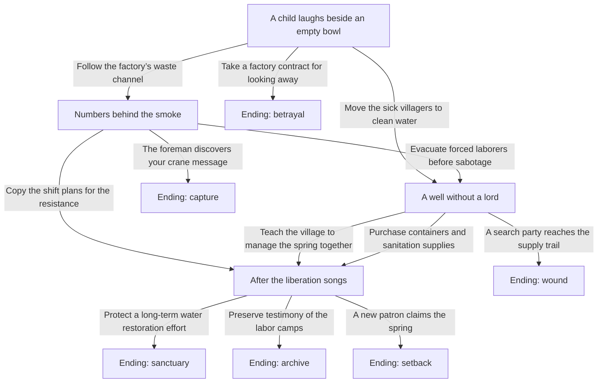
```mermaid
flowchart TD
  opening["A child laughs beside an empty bowl"]
  opening -->|"Follow the factory’s waste channel"| investigation
  opening -->|"Move the sick villagers to clean water"| rescue
  opening -->|"Take a factory contract for looking away"| opening_2["Ending: betrayal"]
  investigation["Numbers behind the smoke"]
  investigation -->|"Copy the shift plans for the resistance"| finale
  investigation -->|"Evacuate forced laborers before sabotage"| rescue
  investigation -->|"The foreman discovers your crane message"| investigation_2["Ending: capture"]
  rescue["A well without a lord"]
  rescue -->|"Teach the village to manage the spring together"| finale
  rescue -->|"Purchase containers and sanitation supplies"| finale
  rescue -->|"A search party reaches the supply trail"| rescue_2["Ending: wound"]
  finale["After the liberation songs"]
  finale -->|"Protect a long-term water restoration effort"| finale_0["Ending: sanctuary"]
  finale -->|"Preserve testimony of the labor camps"| finale_1["Ending: archive"]
  finale -->|"A new patron claims the spring"| finale_2["Ending: setback"]
```

### A child laughs beside an empty bowl

A village cannot trust the river or the food shipments. A folded crane carries a resistance meeting place.

| Wheel result | What happens | Next scene | Mechanical consequence |
| --- | --- | --- | --- |
| Follow the factory’s waste channel | The discharge schedule tells you when the water becomes dangerous. | Numbers behind the smoke | Practice +8 Battle IQ; dream lead +1 |
| Move the sick villagers to clean water | Forced laughter does not mean their pain has ended. | A well without a lord | Crew loyalty +5; trust +1; canon bond +1 |
| Take a factory contract for looking away | The wages buy food for you and another poisoned season for the village. | Permanent ending | ฿20,000; crew loyalty −8; canon bond −2 |

### Numbers behind the smoke

The factory needs a maintenance shutdown; the resistance could use the same opening.

| Wheel result | What happens | Next scene | Mechanical consequence |
| --- | --- | --- | --- |
| Copy the shift plans for the resistance | The plans identify guards, workers, and a path that avoids the dormitories. | After the liberation songs | Evidence +1; practice +5 Battle IQ |
| Evacuate forced laborers before sabotage | Empty beds matter more than an impressive explosion. | A well without a lord | Spend up to ฿10,000; trust +1 |
| The foreman discovers your crane message | You are sent to a labor prison carrying the names you refused to reveal. | Permanent ending | Captured; government heat +1 |

### A well without a lord

A hidden spring can sustain the village if no one sells its location.

| Wheel result | What happens | Next scene | Mechanical consequence |
| --- | --- | --- | --- |
| Teach the village to manage the spring together | Local custodians replace dependence on a single patron. | After the liberation songs | Crew loyalty +5; trust +1; canon bond +1 |
| Purchase containers and sanitation supplies | Transporting clean water becomes daily work rather than a one-time rescue. | After the liberation songs | Spend up to ฿10,000; trust +1 |
| A search party reaches the supply trail | You divert the search and return injured after dark. | Permanent ending | Injury +1; trust +1 |

### After the liberation songs

A victory over occupiers does not automatically clean rivers or cure SMILE’s victims.

| Wheel result | What happens | Next scene | Mechanical consequence |
| --- | --- | --- | --- |
| Protect a long-term water restoration effort | The village gains reliable water and a reason to remain after the celebrations. | Permanent ending | Legacy +2; crew loyalty +8; local refuge; canon bond +2 |
| Preserve testimony of the labor camps | The record names the workers as people rather than statistics in a victory report. | Permanent ending | Legacy +1; dream leads +2; lasting archive |
| A new patron claims the spring | Freedom still requires defending small institutions against familiar habits of power. | Permanent ending | Lose up to ฿5,000; preserve the story in your journal |

## The signal that outlived its speaker

**Canon anchor:** Egghead connects Kuma and Bonney’s history to a government siege and Vegapunk’s broadcast about a world threatened by rising seas. [Source](https://one-piece.com/story/egghead/index.html).

**Connected cast:** Jewelry Bonney, Dr. Vegapunk, Bartholomew Kuma.

**Where:** Egghead Island, G-14. **Starting eras:** New World opening.

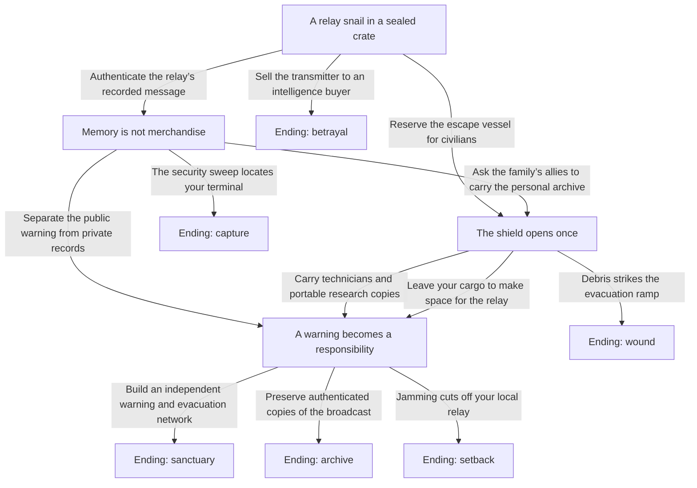
```mermaid
flowchart TD
  opening["A relay snail in a sealed crate"]
  opening -->|"Authenticate the relay’s recorded message"| investigation
  opening -->|"Reserve the escape vessel for civilians"| rescue
  opening -->|"Sell the transmitter to an intelligence buyer"| opening_2["Ending: betrayal"]
  investigation["Memory is not merchandise"]
  investigation -->|"Separate the public warning from private records"| finale
  investigation -->|"Ask the family’s allies to carry the personal archive"| rescue
  investigation -->|"The security sweep locates your terminal"| investigation_2["Ending: capture"]
  rescue["The shield opens once"]
  rescue -->|"Carry technicians and portable research copies"| finale
  rescue -->|"Leave your cargo to make space for the relay"| finale
  rescue -->|"Debris strikes the evacuation ramp"| rescue_2["Ending: wound"]
  finale["A warning becomes a responsibility"]
  finale -->|"Build an independent warning and evacuation network"| finale_0["Ending: sanctuary"]
  finale -->|"Preserve authenticated copies of the broadcast"| finale_1["Ending: archive"]
  finale -->|"Jamming cuts off your local relay"| finale_2["Ending: setback"]
```

### A relay snail in a sealed crate

A technician asks you to carry a broadcast relay out of the siege. Nearby civilians need the same transport.

| Wheel result | What happens | Next scene | Mechanical consequence |
| --- | --- | --- | --- |
| Authenticate the relay’s recorded message | You distinguish a signed recording from a broker’s sensational additions. | Memory is not merchandise | Practice +8 Battle IQ; dream lead +1 |
| Reserve the escape vessel for civilians | The relay will need a smaller carrier; living passengers take the safe berths. | The shield opens once | Crew loyalty +5; trust +1; canon bond +1 |
| Sell the transmitter to an intelligence buyer | The buyer pays to choose what the public will never hear. | Permanent ending | ฿20,000; crew loyalty −8; canon bond −2 |

### Memory is not merchandise

A storage unit contains private material related to Kuma’s family alongside public scientific warnings.

| Wheel result | What happens | Next scene | Mechanical consequence |
| --- | --- | --- | --- |
| Separate the public warning from private records | You preserve evidence without turning a family’s suffering into a trophy. | A warning becomes a responsibility | Evidence +1; practice +5 Battle IQ |
| Ask the family’s allies to carry the personal archive | Custody passes to people with a reason to protect the person behind the data. | The shield opens once | Crew loyalty +5; trust +1; canon bond +1 |
| The security sweep locates your terminal | The message survives in another copy while you face detention. | Permanent ending | Captured; government heat +1 |

### The shield opens once

The evacuation window is too short for every machine in the lab.

| Wheel result | What happens | Next scene | Mechanical consequence |
| --- | --- | --- | --- |
| Carry technicians and portable research copies | People who understand the work can rebuild what a crate cannot explain. | A warning becomes a responsibility | Crew loyalty +5; trust +1; canon bond +1 |
| Leave your cargo to make space for the relay | You trade a profitable voyage for a fragile signal. | A warning becomes a responsibility | Spend up to ฿10,000; trust +1 |
| Debris strikes the evacuation ramp | Others haul you aboard before the route closes. | Permanent ending | Injury +1; trust +1 |

### A warning becomes a responsibility

The broadcast’s revelations demand preparation; possessing a relay grants no Ancient Weapon or automatic answer to the Void Century.

| Wheel result | What happens | Next scene | Mechanical consequence |
| --- | --- | --- | --- |
| Build an independent warning and evacuation network | Coastal communities gain tide logs, marked routes, and working communication. | Permanent ending | Legacy +2; crew loyalty +8; local refuge; canon bond +2 |
| Preserve authenticated copies of the broadcast | The record can be checked against the source instead of repeated as rumor. | Permanent ending | Legacy +1; dream leads +2; lasting archive |
| Jamming cuts off your local relay | The wider warning exists, but your harbor must rebuild its means of hearing it. | Permanent ending | Lose up to ฿5,000; preserve the story in your journal |

## The library beneath the giant tree

**Canon anchor:** The journey from Egghead reaches Elbaph, where giant history and the survival of Ohara’s books give Robin’s search new meaning. [Source](https://www.shueisha.co.jp/books/items/contents.html?jdcn=08X10000000063450500).

**Connected cast:** Nico Robin, Dorry, Brogy.

**Where:** Elbaph. **Starting eras:** New World opening.

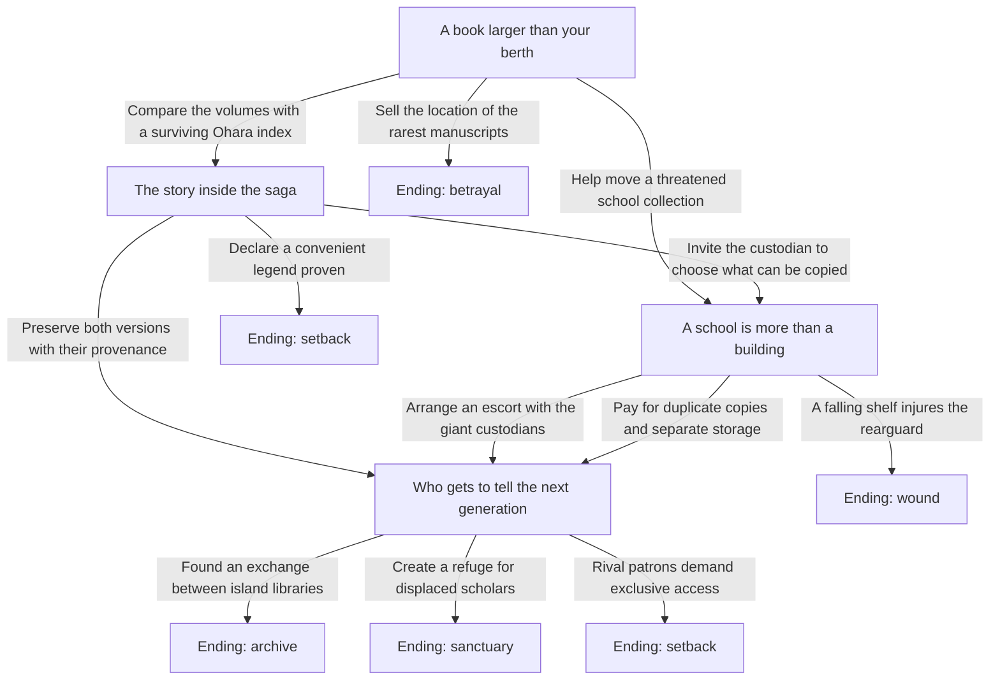
```mermaid
flowchart TD
  opening["A book larger than your berth"]
  opening -->|"Compare the volumes with a surviving Ohara index"| investigation
  opening -->|"Help move a threatened school collection"| rescue
  opening -->|"Sell the location of the rarest manuscripts"| opening_2["Ending: betrayal"]
  investigation["The story inside the saga"]
  investigation -->|"Preserve both versions with their provenance"| finale
  investigation -->|"Invite the custodian to choose what can be copied"| rescue
  investigation -->|"Declare a convenient legend proven"| investigation_2["Ending: setback"]
  rescue["A school is more than a building"]
  rescue -->|"Arrange an escort with the giant custodians"| finale
  rescue -->|"Pay for duplicate copies and separate storage"| finale
  rescue -->|"A falling shelf injures the rearguard"| rescue_2["Ending: wound"]
  finale["Who gets to tell the next generation"]
  finale -->|"Found an exchange between island libraries"| finale_0["Ending: archive"]
  finale -->|"Create a refuge for displaced scholars"| finale_1["Ending: sanctuary"]
  finale -->|"Rival patrons demand exclusive access"| finale_2["Ending: setback"]
```

### A book larger than your berth

A giant custodian asks for help cataloguing water-damaged human-sized volumes among an enormous collection.

| Wheel result | What happens | Next scene | Mechanical consequence |
| --- | --- | --- | --- |
| Compare the volumes with a surviving Ohara index | A shelf mark bridges two libraries that should never have been separated. | The story inside the saga | Practice +8 Battle IQ; dream lead +1 |
| Help move a threatened school collection | Children need a safe place to learn before visitors need access to rare books. | A school is more than a building | Crew loyalty +5; trust +1; canon bond +1 |
| Sell the location of the rarest manuscripts | A collector now knows which shelves to target. The custodians will remember the leak. | Permanent ending | ฿20,000; crew loyalty −8; canon bond −2 |

### The story inside the saga

An old warrior’s oral account disagrees with a written annotation.

| Wheel result | What happens | Next scene | Mechanical consequence |
| --- | --- | --- | --- |
| Preserve both versions with their provenance | Disagreement becomes a research question instead of an excuse to erase one witness. | Who gets to tell the next generation | Evidence +1; practice +5 Battle IQ |
| Invite the custodian to choose what can be copied | Access becomes a relationship with responsibilities. | A school is more than a building | Crew loyalty +5; trust +1; canon bond +1 |
| Declare a convenient legend proven | The claim wins attention and fails the first careful comparison. | Permanent ending | Lose up to ฿5,000; preserve the story in your journal |

### A school is more than a building

Moving the books exposes the children’s route to opportunistic raiders.

| Wheel result | What happens | Next scene | Mechanical consequence |
| --- | --- | --- | --- |
| Arrange an escort with the giant custodians | Local knowledge keeps the procession on a defensible path. | Who gets to tell the next generation | Crew loyalty +5; trust +1; canon bond +1 |
| Pay for duplicate copies and separate storage | The collection can survive the loss of one building. | Who gets to tell the next generation | Spend up to ฿10,000; trust +1 |
| A falling shelf injures the rearguard | The books and children arrive while you need several months of care. | Permanent ending | Injury +1; trust +1 |

### Who gets to tell the next generation

The archive can connect cultures without turning an unfinished history into a definitive prophecy.

| Wheel result | What happens | Next scene | Mechanical consequence |
| --- | --- | --- | --- |
| Found an exchange between island libraries | Careful copies travel with attribution and permission; the originals remain with their custodians. | Permanent ending | Legacy +1; dream leads +2; lasting archive |
| Create a refuge for displaced scholars | Readers gain time, shelter, and a community willing to defend learning. | Permanent ending | Legacy +2; crew loyalty +8; local refuge; canon bond +2 |
| Rival patrons demand exclusive access | The custodians close the collection until a fair agreement can be restored. | Permanent ending | Lose up to ฿5,000; preserve the story in your journal |

## A logbook before the great era

**Canon anchor:** Roger’s final voyage reaches the last island; his execution later launches the Great Pirate Era. Your parallel voyage does not reveal an invented canon answer to the treasure. [Source](https://one-piece.com/story/land_of_wano2/index.html).

**Connected cast:** Gol D. Roger, Silvers Rayleigh, Crocus.

**Where:** Twins Cape, Loadestar Island. **Starting eras:** Roger’s final voyage.

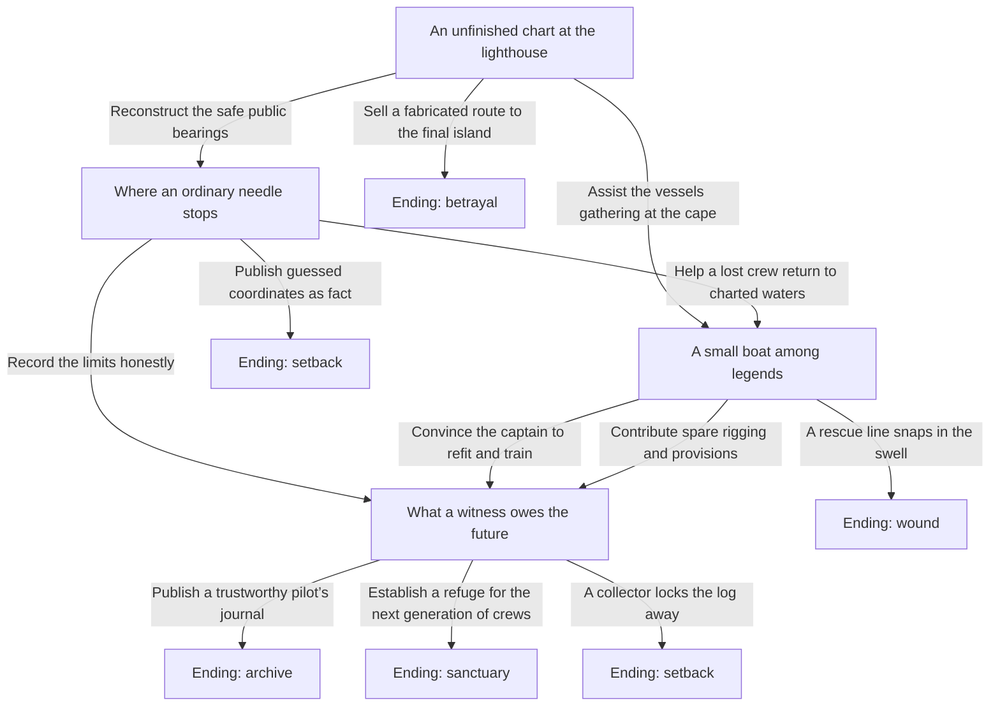
```mermaid
flowchart TD
  opening["An unfinished chart at the lighthouse"]
  opening -->|"Reconstruct the safe public bearings"| investigation
  opening -->|"Assist the vessels gathering at the cape"| rescue
  opening -->|"Sell a fabricated route to the final island"| opening_2["Ending: betrayal"]
  investigation["Where an ordinary needle stops"]
  investigation -->|"Record the limits honestly"| finale
  investigation -->|"Help a lost crew return to charted waters"| rescue
  investigation -->|"Publish guessed coordinates as fact"| investigation_2["Ending: setback"]
  rescue["A small boat among legends"]
  rescue -->|"Convince the captain to refit and train"| finale
  rescue -->|"Contribute spare rigging and provisions"| finale
  rescue -->|"A rescue line snaps in the swell"| rescue_2["Ending: wound"]
  finale["What a witness owes the future"]
  finale -->|"Publish a trustworthy pilot’s journal"| finale_0["Ending: archive"]
  finale -->|"Establish a refuge for the next generation of crews"| finale_1["Ending: sanctuary"]
  finale -->|"A collector locks the log away"| finale_2["Ending: setback"]
```

### An unfinished chart at the lighthouse

A passing crew leaves a damaged log for repair. The erased bearings suggest a route its navigator deliberately protected.

| Wheel result | What happens | Next scene | Mechanical consequence |
| --- | --- | --- | --- |
| Reconstruct the safe public bearings | Crocus distinguishes navigational help from a captain’s private destination. | Where an ordinary needle stops | Practice +8 Battle IQ; dream lead +1 |
| Assist the vessels gathering at the cape | Rookies need weather advice more urgently than legends need admirers. | A small boat among legends | Crew loyalty +5; trust +1; canon bond +1 |
| Sell a fabricated route to the final island | Your buyers pay for certainty you do not possess. | Permanent ending | ฿20,000; crew loyalty −8; canon bond −2 |

### Where an ordinary needle stops

A copied entry describes the limits of following the Log Pose alone.

| Wheel result | What happens | Next scene | Mechanical consequence |
| --- | --- | --- | --- |
| Record the limits honestly | Your notes identify the need for other evidence without conjuring a Road Poneglyph. | What a witness owes the future | Evidence +1; practice +5 Battle IQ |
| Help a lost crew return to charted waters | A safe return preserves a dream better than a glorious disappearance. | A small boat among legends | Spend up to ฿10,000; trust +1 |
| Publish guessed coordinates as fact | The first expedition returns with broken instruments and justified anger. | Permanent ending | Lose up to ฿5,000; preserve the story in your journal |

### A small boat among legends

An overloaded vessel wants to follow a famous sail into weather it cannot survive.

| Wheel result | What happens | Next scene | Mechanical consequence |
| --- | --- | --- | --- |
| Convince the captain to refit and train | The voyage is postponed, not abandoned. | What a witness owes the future | Crew loyalty +5; trust +1; canon bond +1 |
| Contribute spare rigging and provisions | The crew’s next attempt begins with practical preparation. | What a witness owes the future | Spend up to ฿10,000; trust +1 |
| A rescue line snaps in the swell | You return with the crew and a hard-earned respect for the current. | Permanent ending | Injury +1; trust +1 |

### What a witness owes the future

The era is changing, and strangers ask you for a story worth chasing.

| Wheel result | What happens | Next scene | Mechanical consequence |
| --- | --- | --- | --- |
| Publish a trustworthy pilot’s journal | Your record leaves room for wonder without selling false certainty. | Permanent ending | Legacy +1; dream leads +2; lasting archive |
| Establish a refuge for the next generation of crews | A lighthouse table becomes a place where ambition can learn seamanship. | Permanent ending | Legacy +2; crew loyalty +8; local refuge; canon bond +2 |
| A collector locks the log away | The safest bearings survive in your memory, but the original disappears from public reach. | Permanent ending | Lose up to ฿5,000; preserve the story in your journal |

## The empty chair at supper

**Canon anchor:** Original side story about chosen family, promises, and the cost of command; no canonical event is asserted. Original side story.

**Connected cast:** Original local characters.

**Where:** Any mapped sea. **Starting eras:** Roger’s final voyage, Early Great Pirate Era, Summit War opening, New World opening.

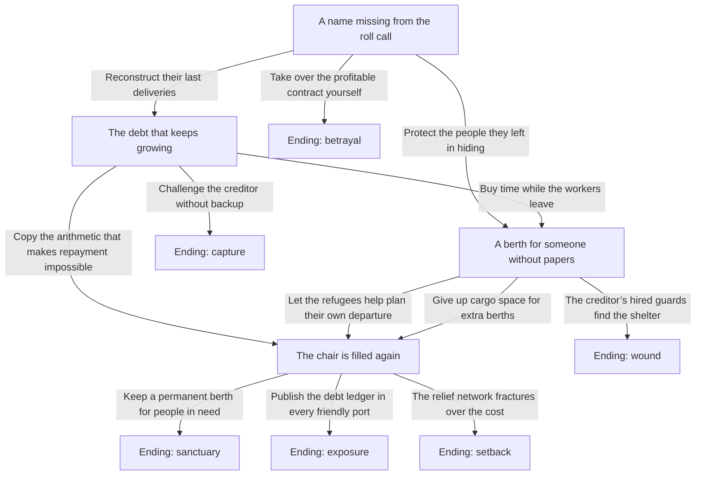
```mermaid
flowchart TD
  opening["A name missing from the roll call"]
  opening -->|"Reconstruct their last deliveries"| investigation
  opening -->|"Protect the people they left in hiding"| rescue
  opening -->|"Take over the profitable contract yourself"| opening_2["Ending: betrayal"]
  investigation["The debt that keeps growing"]
  investigation -->|"Copy the arithmetic that makes repayment impossible"| finale
  investigation -->|"Buy time while the workers leave"| rescue
  investigation -->|"Challenge the creditor without backup"| investigation_2["Ending: capture"]
  rescue["A berth for someone without papers"]
  rescue -->|"Let the refugees help plan their own departure"| finale
  rescue -->|"Give up cargo space for extra berths"| finale
  rescue -->|"The creditor’s hired guards find the shelter"| rescue_2["Ending: wound"]
  finale["The chair is filled again"]
  finale -->|"Keep a permanent berth for people in need"| finale_0["Ending: sanctuary"]
  finale -->|"Publish the debt ledger in every friendly port"| finale_1["Ending: exposure"]
  finale -->|"The relief network fractures over the cost"| finale_2["Ending: setback"]
```

### A name missing from the roll call

A port relief worker has vanished after helping a stranger. Their unfinished meal is still on the table.

| Wheel result | What happens | Next scene | Mechanical consequence |
| --- | --- | --- | --- |
| Reconstruct their last deliveries | The delivery list points toward a creditor buying labor contracts. | The debt that keeps growing | Practice +8 Battle IQ; dream lead +1 |
| Protect the people they left in hiding | The hidden travelers know why the relief worker took such a risk. | A berth for someone without papers | Crew loyalty +5; trust +1; canon bond +1 |
| Take over the profitable contract yourself | You inherit the income and the obligations that trapped your predecessor. | Permanent ending | ฿20,000; crew loyalty −8; canon bond −2 |

### The debt that keeps growing

The contract charges workers for the food and shelter required to do the work.

| Wheel result | What happens | Next scene | Mechanical consequence |
| --- | --- | --- | --- |
| Copy the arithmetic that makes repayment impossible | The ledger proves the debt was designed never to end. | The chair is filled again | Evidence +1; practice +5 Battle IQ |
| Buy time while the workers leave | You pay a deposit and quietly prepare a different route. | A berth for someone without papers | Spend up to ฿10,000; trust +1 |
| Challenge the creditor without backup | The creditor turns your interference into another enforceable debt. | Permanent ending | Captured; government heat +1 |

### A berth for someone without papers

Sheltering the workers may cost your crew access to a reliable port.

| Wheel result | What happens | Next scene | Mechanical consequence |
| --- | --- | --- | --- |
| Let the refugees help plan their own departure | Their knowledge produces an exit your crew could not have found alone. | The chair is filled again | Crew loyalty +5; trust +1; canon bond +1 |
| Give up cargo space for extra berths | The next voyage begins poorer and with everyone accounted for. | The chair is filled again | Spend up to ฿10,000; trust +1 |
| The creditor’s hired guards find the shelter | You hold them long enough for the others to leave. | Permanent ending | Injury +1; trust +1 |

### The chair is filled again

The missing worker returns to find that their rescue has changed what your flag means.

| Wheel result | What happens | Next scene | Mechanical consequence |
| --- | --- | --- | --- |
| Keep a permanent berth for people in need | Your flag becomes a promise with a practical cost, not merely a boast. | Permanent ending | Legacy +2; crew loyalty +8; local refuge; canon bond +2 |
| Publish the debt ledger in every friendly port | The creditor loses the protection of secrecy and knows whom to blame. | Permanent ending | Dream leads +2; government heat +2; outlaw bounty +฿50,000 |
| The relief network fractures over the cost | The rescued workers are safe, but rebuilding trust will take more than a speech. | Permanent ending | Lose up to ฿5,000; preserve the story in your journal |

## The map with three owners

**Canon anchor:** Original treasure voyage built around unreliable charts, salvage rights, and the people missing from legends. Original side story.

**Connected cast:** Original local characters.

**Where:** Any mapped sea. **Starting eras:** Roger’s final voyage, Early Great Pirate Era, Summit War opening, New World opening.

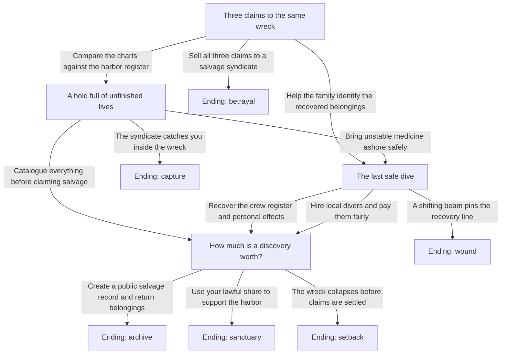
```mermaid
flowchart TD
  opening["Three claims to the same wreck"]
  opening -->|"Compare the charts against the harbor register"| investigation
  opening -->|"Help the family identify the recovered belongings"| rescue
  opening -->|"Sell all three claims to a salvage syndicate"| opening_2["Ending: betrayal"]
  investigation["A hold full of unfinished lives"]
  investigation -->|"Catalogue everything before claiming salvage"| finale
  investigation -->|"Bring unstable medicine ashore safely"| rescue
  investigation -->|"The syndicate catches you inside the wreck"| investigation_2["Ending: capture"]
  rescue["The last safe dive"]
  rescue -->|"Recover the crew register and personal effects"| finale
  rescue -->|"Hire local divers and pay them fairly"| finale
  rescue -->|"A shifting beam pins the recovery line"| rescue_2["Ending: wound"]
  finale["How much is a discovery worth?"]
  finale -->|"Create a public salvage record and return belongings"| finale_0["Ending: archive"]
  finale -->|"Use your lawful share to support the harbor"| finale_1["Ending: sanctuary"]
  finale -->|"The wreck collapses before claims are settled"| finale_2["Ending: setback"]
```

### Three claims to the same wreck

A fisher, a merchant, and a bereaved family each bring a map of the same lost ship. Only one calls its contents treasure.

| Wheel result | What happens | Next scene | Mechanical consequence |
| --- | --- | --- | --- |
| Compare the charts against the harbor register | The vessel changed names twice, leaving each claimant part of the truth. | A hold full of unfinished lives | Practice +8 Battle IQ; dream lead +1 |
| Help the family identify the recovered belongings | A carved spoon establishes a connection gold cannot prove. | The last safe dive | Crew loyalty +5; trust +1; canon bond +1 |
| Sell all three claims to a salvage syndicate | The syndicate sends guards instead of a mediator. | Permanent ending | ฿20,000; crew loyalty −8; canon bond −2 |

### A hold full of unfinished lives

The wreck’s cargo includes wages, medicine, and personal effects alongside coins.

| Wheel result | What happens | Next scene | Mechanical consequence |
| --- | --- | --- | --- |
| Catalogue everything before claiming salvage | An inventory makes it harder to pretend every recovered object has no owner. | How much is a discovery worth? | Evidence +1; practice +5 Battle IQ |
| Bring unstable medicine ashore safely | Careful transport costs more than the resale value of the damaged crates. | The last safe dive | Spend up to ฿10,000; trust +1 |
| The syndicate catches you inside the wreck | Your dive becomes evidence in a claim backed by armed men. | Permanent ending | Captured; government heat +1 |

### The last safe dive

A storm will seal the wreck under sediment; one more descent must have a clear purpose.

| Wheel result | What happens | Next scene | Mechanical consequence |
| --- | --- | --- | --- |
| Recover the crew register and personal effects | The families can finally learn who sailed together. | How much is a discovery worth? | Crew loyalty +5; trust +1; canon bond +1 |
| Hire local divers and pay them fairly | The people taking the risk share control over the recovery. | How much is a discovery worth? | Spend up to ฿10,000; trust +1 |
| A shifting beam pins the recovery line | The divers rescue you and abandon the dangerous section. | Permanent ending | Injury +1; trust +1 |

### How much is a discovery worth?

The harbor waits to learn whether your first instinct after finding treasure is to claim or to account.

| Wheel result | What happens | Next scene | Mechanical consequence |
| --- | --- | --- | --- |
| Create a public salvage record and return belongings | Future claims have evidence, and the families regain pieces of their history. | Permanent ending | Legacy +1; dream leads +2; lasting archive |
| Use your lawful share to support the harbor | A modest fortune becomes repairs, rescue equipment, and wages. | Permanent ending | Legacy +2; crew loyalty +8; local refuge; canon bond +2 |
| The wreck collapses before claims are settled | You preserve the register, but the remaining wealth belongs to the sea. | Permanent ending | Lose up to ฿5,000; preserve the story in your journal |

## Source notes

Official ONE PIECE story summaries supply the broad arc anchors. The Elbaph library entry additionally references Shueisha volume 112, which lists chapter 1134, and [the official Robin/Saul reunion episode](https://one-piece.com/anime/80333/index.html). The [official story index](https://one-piece.com/story/index.html) identifies the current arc. Links were researched on 2026-09-19. The episode and volume numbers are distinct.

The original cast remains a curated starting-era snapshot: later deaths, crew transfers, and power developments are not automatically simulated. Saga required-cast deaths recorded in the player’s alternate timeline block future saga selection. New cast ratings and all odds are game balance, not official power scaling.
